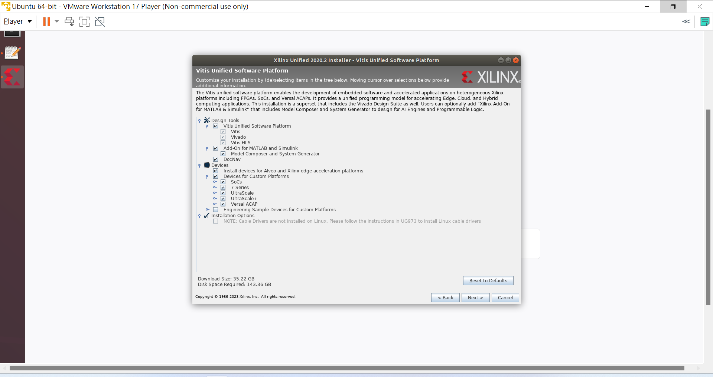
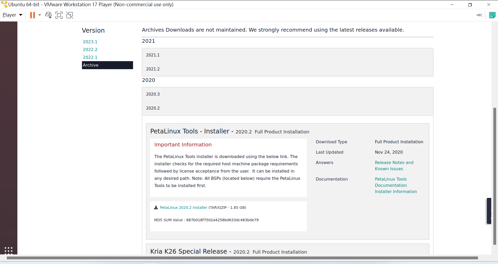

# 第零課: 製作ZCU102的PYNQ鏡像檔案  
詳細步驟可以參考[PYNQ網站的教學](https://pynq.readthedocs.io/en/latest/pynq_sd_card.html#pynq-sd-card-image)，本文僅紀錄個人製作的步驟。  
  
> [!NOTE]
> 參考[Prepare the Building Environment](https://pynq.readthedocs.io/en/latest/pynq_sd_card.html#prepare-the-building-environment)部分，本文系統使用Ubuntu 18.04.6 LTS。
  
> [!TIP]
> 可以在VMware Workstation Player中安裝Ubuntu系統。
  
> [!WARNING]
> 此文章記錄的指令執行於2023年9月23日，`ZCU102_v2.7_指令.txt`中的連結可能已經失效了。
  
## Ubuntu套件  
在終端機執行下列指令:  
1. 以系統管理員的權限更新系統套件列表。
```console
sudo apt-get update
```
2. 以系統管理員的權限升級所有已安裝的套件到最新版本。
```console
sudo apt-get upgrade
```
3. 以系統管理員的權限安裝libtinfo5的套件。
```console
sudo apt-get install libtinfo5
```
4. 以系統管理員的權限安裝libncurses5的套件
```console
sudo apt-get install libncurses5
```
  
> [!NOTE]
> 參考[Vivado 2018.3 Final Processing hangs at 'Generating installed device list' on Ubuntu 19.04](https://support.xilinx.com/s/question/0D52E00006hpmTmSAI/vivado-20183-final-processing-hangs-at-generating-installed-device-list-on-ubuntu-1904?language=en_US)文章，不安裝套件會使Vivado安裝失敗。
  
## 下載並安裝Vivado 2020.2  
先在[Vitis網站](https://www.xilinx.com/support/download/index.html/content/xilinx/en/downloadNav/vitis/archive-vitis.html)下載`Xilinx_Unified_2020.2_1118_1232_Lin64.bin`檔案。  
  
  
> [!NOTE]
> 圖一中的`Xilinx Unified Installer 2020.2: Linux Self Extracting Web Installer (BIN - 354.08 MB)`選項。
  
在包含下載檔案的終端機執行下列指令:  
1. 改變檔案的權限，讓所有使用者（a代表all，所有使用者）都可以執行（x代表execute，執行）這個檔案。
```console
chmod a+x Xilinx_Unified_2020.2_1118_1232_Lin64.bin
```
2. 以系統管理員的權限（sudo）執行當前目錄下的`Xilinx_Unified_2020.2_1118_1232_Lin64.bin`這個檔案。
```console
sudo ./Xilinx_Unified_2020.2_1118_1232_Lin64.bin
```
  
> [!NOTE]
> 本文檔案下載在`/home/username/Downloads`這個位置中，下文中所有`username`請自行帶入使用者名稱。
> 
> 圖二為本文Vivado的安裝設定。
>   
  
在`/home/username`下執行下列指令:  
1. 在當前目錄下建立一個名為Xilinx的新目錄。
```console
mkdir Xilinx
```
  
> [!NOTE]
> 參考[制作ZCU102的PYNQ镜像](https://zhuanlan.zhihu.com/p/582574230)文章。
  
## 啟動Vivado 2020.2  
在終端機執行下列指令:  
1. 以系統管理員的權限（sudo）更改root使用者的密碼。
```console
sudo passwd root
```
2. 切換到root使用者。
```console
su root
```
3. 改變當前的工作目錄到`/home/username/Xilinx/Vivado/2020.2`。
```console
cd /home/username/Xilinx/Vivado/2020.2
```
4. 執行`source`命令來讀取並執行`/home/username/Xilinx/Vivado/2020.2/settings64.sh`這個檔案中的指令。這通常用於設定環境變數。
```console
source /home/username/Xilinx/Vivado/2020.2/settings64.sh
```
5. 在背景中啟動`vivado`程式。`&`符號表示將程式放到背景執行。
```console
vivado&
```
  
> [!TIP]
> `su`是Substitute User的縮寫，用於切換到其他使用者。  
> `cd`是Change Directory的縮寫。
  
## 安裝tftp-hpa和tftpd-hpa兩個套件  
在`/home/username`下執行下列指令:  
1. 以系統管理員的權限（sudo）安裝`tftp-hpa`和`tftpd-hpa`這兩個套件。
```console
sudo apt-get install tftp-hpa tftpd-hpa
```
2. 以系統管理員的權限（sudo）在根目錄下建立一個名為`tftpboot`的新目錄。如果該目錄的上層目錄尚未存在，`-p`選項會自動建立上層目錄。
```console
sudo mkdir -p /tftpboot
```
3. 改變`/tftpboot`這個目錄的權限，讓所有使用者都可以讀取、寫入和執行這個目錄。
```console
sudo chmod 777 /tftpboot
```
4. 以系統管理員的權限（sudo）開啟Nautilus檔案管理器。
```console
sudo nautilus
```
  
改動`/etc/default/tftpd-hpa`文件內容:  
```text
TFTP_USERNAME="tftp"
TFTP_DIRECTORY="/tftpboot"
TFTP_ADDRESS=":69"
TFTP_OPTIONS="-l -c -s"
```
5. 重新啟動電腦。
```console
reboot
```
  
> [!NOTE]
> 參考[Read Only Files in ubuntu 20.04 LTS](https://askubuntu.com/questions/1249290/read-only-files-in-ubuntu-20-04-lts)文章。
  
## PetaLinux安裝  
在`/home/username`下執行下列指令:  
1. 以系統管理員的權限（sudo）啟動`tftpd-hpa`服務。
```console
sudo service tftpd-hpa start
```
2. 先在[PetaLinux網站](https://www.xilinx.com/support/download/index.html/content/xilinx/en/downloadNav/embedded-design-tools/archive.html)下載`2020.2版本`。  

  
改變`./petalinux-v2020.2-final-installer.run`檔案的權限，讓所有使用者都可以執行這個檔案。
```console
sudo chmod a+x ./petalinux-v2020.2-final-installer.run
```
3. 在家目錄下的`Xilinx/petalinux`目錄中建立一個名為`2020.2`的新目錄。如果該目錄的上層目錄尚未存在，`-p`選項會自動建立上層目錄。
```console
mkdir -p ~/Xilinx/petalinux/2020.2
```
4. 以系統管理員的權限（sudo）在系統中新增i386這個架構。
```console
sudo dpkg --add-architecture i386
```
5. 更新系統套件列表。
```console
sudo apt-get update
```
6. 安裝一系列的套件。
```console
sudo apt-get install gcc net-tools xterm autoconf libtool texinfo zlib1g zlib1g-dev gcc-multilib libncurses5-dev zlib1g:i386 build-essential 
```
7. 安裝gawk套件。
```console
sudo apt-get install gawk
```
8. 執行`petalinux-v2020.2-final-installer.run`這個檔案，並將安裝目錄設定為`~/Xilinx/petalinux/2020.2`。
```console
./petalinux-v2020.2-final-installer.run --dir ~/Xilinx/petalinux/2020.2
```
9. 以系統管理員的權限（sudo）重新設定dash這個套件。
```console
sudo dpkg-reconfigure dash
```
10. 改變當前的工作目錄到`/home/username/Xilinx/petalinux/2020.2`。
```console
cd /home/username/Xilinx/petalinux/2020.2
```
11. 讀取並執行`settings.sh`這個檔案中的指令。
```console
source settings.sh
```
  
## ZCU102板子設置  
在`/home/username`下執行下列指令:  
1. 以系統管理員的權限（sudo）安裝git套件。
```console
sudo apt-get install git
```
2. 複製位git倉庫。`--recursive`選項表示會一併複製所有的子模組（submodule）。
```console
git clone --recursive https://github.com/Xilinx/PYNQ.git
```
3. 改變當前的工作目錄到`PYNQ`。
```console
cd PYNQ
```
4. 切換到`origin/image_v2.7`這個分支。`checkout`是一個git指令，用於切換到其他分支或提交。
```console
git checkout origin/image_v2.7
```
5. 改變當前的工作目錄到`/home/username/PYNQ/sdbuild/scripts`。
```console
cd /home/username/PYNQ/sdbuild/scripts
```
6. 執行當前目錄下的`setup_host.sh`這個shell腳本。
```console
./setup_host.sh
```
7. 改變當前的工作目錄到`/home/username/PYNQ/boards`。
```console
cd /home/username/PYNQ/boards
```
8. 複製ZCU104這個目錄及其內容到ZCU102。`-r`選項表示會複製目錄及其內部的所有檔案和子目錄，`-f`選項表示在需要時會強制覆寫目標檔案或目錄。
```console
cp -rf ZCU104 ZCU102
```
9. 刪除`ZCU102/petalinux_bsp/`這個目錄及其內部的所有檔案和子目錄。
```console
rm -rf ZCU102/petalinux_bsp/
```
10. 將`ZCU102/ZCU104.spec`這個檔案重新命名為`ZCU102/ZCU102.spec`。
```console
mv ZCU102/ZCU104.spec ZCU102/ZCU102.spec
```
11. 在`ZCU102/ZCU102.spec`這個檔案中，將所有的`104`替換為`102`。sed是一個串流編輯器，用於對輸入的串流進行轉換。
```console
sed -i -e "s/104/102/g" ZCU102/ZCU102.spec
```
複製以下內容到`ZCU102.spec`中。
```text
ARCH_ZCU102 := aarch64
BSP_ZCU102 := xilinx-zcu102-v2020.2-final.bsp
BITSTREAM_ZCU102 := base/base.bit
FPGA_MANAGER_ZCU102 := 1

STAGE4_PACKAGES_ZCU102 := xrt ethernet sensorconf boot_leds
```
12. 變當前的工作目錄到`/home/username/PYNQ/sdbuild`。
```console
cd /home/username/PYNQ/sdbuild
```
13. 在當前目錄下建立一個名為`prebuilt`的新目錄。
```console
mkdir prebuilt
```
14. 把`focal.aarch64.2.7.0_2021_11_17.tar.gz`移動至`prebuilt`目錄。
15. 把`xilinx-zcu102-v2020.2-final.bsp`移動至`PYNQ/boards/ZCU102`目錄。
  
> [!NOTE]
> 參考[Ubuntu 上安裝 git 並抓取程式碼 Install git on Ubuntu and Obtain the codes](https://hackmd.io/@sam-liaw/BkzQ9zC0B)文章。
  
## 製作鏡像  
在`/home/username`下執行下列指令:  
1. 改變當前的工作目錄到`/home/username/PYNQ/sdbuild`。
```console
cd /home/username/PYNQ/sdbuild
```
2. 將`/opt/qemu/bin`和`/opt/crosstool-ng/bin`這兩個目錄加入到PATH環境變數中。
```console
PATH=/opt/qemu/bin:/opt/crosstool-ng/bin:$PATH
```
3. 執行`source`命令來讀取並執行`~/Xilinx/Vitis/2020.2/settings64.sh`這個檔案中的指令。
```console
source ~/Xilinx/Vitis/2020.2/settings64.sh
```
4. 執行`source`命令來讀取並執行`~/Xilinx/Vivado/2020.2/settings64.sh`這個檔案中的指令。
```console
source ~/Xilinx/Vivado/2020.2/settings64.sh
```
5. 執行`source`命令來讀取並執行`~/Xilinx/petalinux/2020.2/settings.sh`這個檔案中的指令。
```console
source ~/Xilinx/petalinux/2020.2/settings.sh
```
6. 執行`make`命令來建立boot_files，並將`BOARDS`變數設定為ZCU102。
```console
make boot\_files BOARDS=ZCU102
```
7. 執行`make`命令來建立images，並將`BOARDS`變數設定為ZCU102，`PREBUILT`變數設定為`./prebuilt/focal.aarch64.2.7.0_2021_11_17.tar.gz`。
```console
make images BOARDS=ZCU102 PREBUILT=./prebuilt/focal.aarch64.2.7.0_2021_11_17.tar.gz
```
  
> [!NOTE]
> 參考[這篇文章](https://blog.csdn.net/ssunrt/article/details/125218877)，如果出現isl error可以下載[別的地方的備份](http://mirror.sobukus.de/files/src/isl/)的檔案。