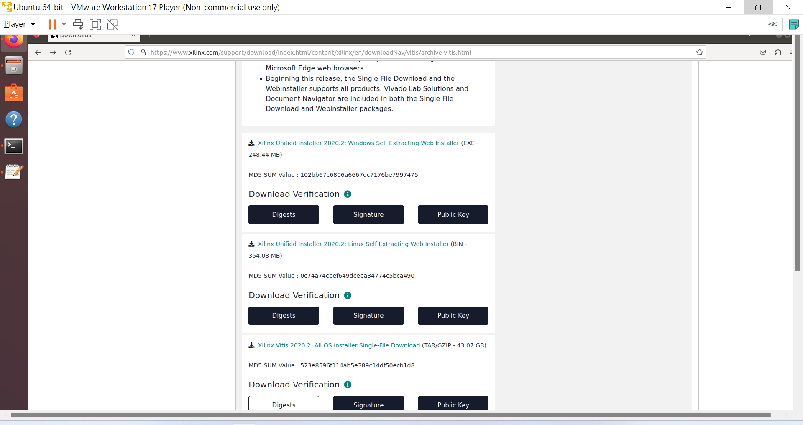

# 第零課: 製作ZCU102的PYNQ鏡像檔案  
詳細步驟可以參考[PYNQ網站的教學](https://pynq.readthedocs.io/en/latest/pynq_sd_card.html#pynq-sd-card-image)，本文僅紀錄個人製作的步驟。  
  
> [!NOTE]
> 參考[Prepare the Building Environment](https://pynq.readthedocs.io/en/latest/pynq_sd_card.html#prepare-the-building-environment)部分，本文系統使用Ubuntu 18.04.6 LTS。
  
> [!TIP]
> 可以在VMware Workstation Player中安裝Ubuntu系統。
  
> [!WARNING]
> 此文章記錄的指令執行於2023年9月23日。
  
## Ubuntu套件  
在終端機執行下列指令:  
1. 以系統管理員的權限更新系統套件列表。
```console
sudo apt-get update
```
2. 以系統管理員的權限升級所有已安裝的套件到最新版本。
```console
sudo apt-get upgrade
```
3. 以系統管理員的權限安裝libtinfo5的套件。
```console
sudo apt-get install libtinfo5
```
4. 以系統管理員的權限安裝libncurses5的套件
```console
sudo apt-get install libncurses5
```
  
> [!NOTE]
> 參考[Vivado 2018.3 Final Processing hangs at 'Generating installed device list' on Ubuntu 19.04](https://support.xilinx.com/s/question/0D52E00006hpmTmSAI/vivado-20183-final-processing-hangs-at-generating-installed-device-list-on-ubuntu-1904?language=en_US)文章，不安裝套件會使Vivado安裝失敗。
  
## 下載並安裝Vivado 2020.2  
先在[Vitis網站](https://www.xilinx.com/support/download/index.html/content/xilinx/en/downloadNav/vitis/archive-vitis.html)下載`Xilinx_Unified_2020.2_1118_1232_Lin64.bin`檔案。  
  
  
> [!NOTE]
> 圖一中的`Xilinx Unified Installer 2020.2: Linux Self Extracting Web Installer (BIN - 354.08 MB)`選項。
  
在包含下載檔案的終端機執行下列指令:  
1. 改變檔案的權限，讓所有使用者（a代表all，所有使用者）都可以執行（x代表execute，執行）這個檔案。
```console
chmod a+x Xilinx_Unified_2020.2_1118_1232_Lin64.bin
```
2. 以系統管理員的權限（sudo）執行當前目錄下的`Xilinx_Unified_2020.2_1118_1232_Lin64.bin`這個檔案。
```console
sudo ./Xilinx_Unified_2020.2_1118_1232_Lin64.bin
```
  
> [!NOTE]
> 本文檔案下載在`/home/username/Downloads`這個位置中，下文中所有`username`請自行帶入使用者名稱。
>   
  
在`/home/username`下執行下列指令:  
1. 在當前目錄下建立一個名為Xilinx的新目錄。
```console
$mkdir Xilinx
```
  
> [!NOTE]
> 參考[制作ZCU102的PYNQ镜像](https://zhuanlan.zhihu.com/p/582574230)文章。
  
## 啟動Vivado 2020.2  
在終端機執行下列指令:  
1. 以系統管理員的權限（sudo）更改root使用者的密碼。
```console
sudo passwd root
```
2. 切換到root使用者。
```console
su root
```
3. 改變當前的工作目錄到 /home/username/Xilinx/Vivado/2020.2。
```console
cd /home/username/Xilinx/Vivado/2020.2
```
4. 執行`source`命令來讀取並執行`/home/username/Xilinx/Vivado/2020.2/settings64.sh`這個檔案中的指令。這通常用於設定環境變數。
```console
source /home/username/Xilinx/Vivado/2020.2/settings64.sh
```
5. 在背景中啟動`vivado`程式。`&`符號表示將程式放到背景執行。
```console
vivado&
```
  
> [!TIP]
> `su`是Substitute User的縮寫，用於切換到其他使用者。
> `cd`是Change Directory的縮寫。