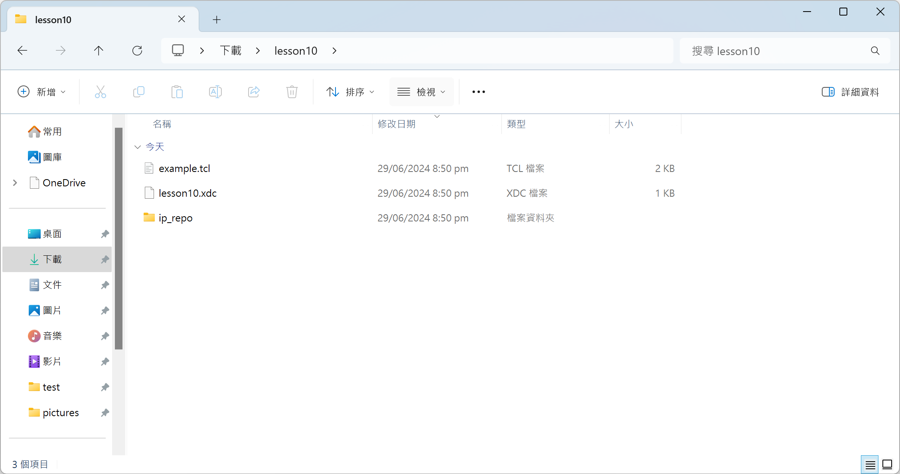

# 第十課: PYNQ MMIO示範  
參考以下內容:
1. [PYNQ Libraries MMIO](https://pynq.readthedocs.io/en/v3.0.0/pynq_libraries/mmio.html)  
2. [pynq.mmio Module](https://pynq.readthedocs.io/en/v3.0.0/pynq_package/pynq.mmio.html)  
3. [PYNQ_Workshop/Session_4/3_mmio.ipynb](https://github.com/Xilinx/PYNQ_Workshop/blob/master/Session_4/3_mmio.ipynb)  
4. [Zynq-7000 SoC Embedded Design Tutorial (UG1165)](https://docs.amd.com/r/en-US/ug1165-zynq-embedded-design-tutorial/Creating-Peripheral-IP?tocId=ygujVLI6H6bFdzQqvT8jKg)  
  
## AXI4-Lite自定義IP功能說明  
創建的Peripheral IP是一個AXI4-Lite的slave IP。  
  
包含一個28位元的計數器，計數器的四個最高有效位(most significant bits)驅動Peripheral IP的四個輸出端口。  
  
包含以下的配置暫存器(configuration register):  
|Register Name|Control Register|
|:---|:---|
|Description|Start/Stop the Counter|
|Access Type|Read/Write|
|Width|1-bit|
|Relative Address|0x0000_0000|
  
|Field Name|Bits|Type|Reset Value|Description|
|:---|:---|:---|:---|:---|
|Control|Bit 0|R/W|0x0|1 : Start Counter 2 : Stop Counter|
  
## Vivado TCL script  
把此倉庫的`lesson10.zip`下載至硬碟中，並且解壓縮到任意位置。  

  
`lesson10.zip`包含三樣東西。  
|檔案|功能|
|:---|:---|
|ip_repo資料夾|包含第八課所製作的AXI4-Lite自定義IP|
|lesson10.xdc|提供GPIO LED腳位|
|example.tcl|Vivado要載入的tcl腳本|
  

  
參考[第九課: 在Vivado中使用TCL腳本](https://github.com/Weng20011103/ZCU102_PYNQ/tree/main/lesson9_vivado_tcl#%E4%BD%BF%E7%94%A8tcl%E8%85%B3%E6%9C%AC)中的內容執行`example.tcl`，等待Bitstream完成。  

  
此Bitstream的Block Diagram如圖四，根據AXI4-Lite自定義IP的`Control Register`決定ZCU102上的GPIO LED的狀態。  
  
  
> [!NOTE]
> 想知道更詳細說明參考[第八課: 新增一個AXI4-Lite的自定義IP](https://github.com/Weng20011103/ZCU102_PYNQ/tree/main/lesson8_axi_lite_custom_ip#%E7%AC%AC%E5%85%AB%E8%AA%B2-%E6%96%B0%E5%A2%9E%E4%B8%80%E5%80%8Baxi4-lite%E7%9A%84%E8%87%AA%E5%AE%9A%E7%BE%A9ip)。
  
## Vivado中確認IP的Physical address  
在Block Design開啟後，點擊`Address Editor`選項。可以看到Blink_0的地址內容。  
|名稱|數值|
|:---|:---|
|Master Base Address|0x00_8000_0000|
|Range|64K|
|Master High Address|0x00_8000_FFFF|
  
  
  
## Jupyter Notebook  
> [!IMPORTANT]
> 下方的程式碼執行結果可以參考此倉庫中的`design_1.ipynb`檔案。
  
將`.bit`和`.hwh`檔移動至`PYNQ`的Jupyter Notebook資料夾中，新建一個`.ipynb`檔案。  
  
執行以下程式:
```python
from pynq import Overlay
overlay = Overlay('design_1.bit')
```
  
> [!WARNING]
> `.bit`檔記得改名。
  
執行以下程式，可以看到包含`Blink_0`的IP。
```python
overlay?
```
  
執行以下程式來引入`MMIO`類別。
```python
from pynq import MMIO
```
  
執行以下程式，獲取並顯示名為`Blink_0`的IP的物理位址。
```python
IP_BASE_ADDRESS = overlay.ip_dict['Blink_0']['phys_addr']
print("Physical address of Blink_0:  0x" + format(IP_BASE_ADDRESS, '02x'))
```
  
> [!TIP]
> 使用`overlay.ip_dict`這個字典，其中包含了所有可訪問的IP。並且從這個字典中選擇了名為`Blink_0`的IP。  
> 
> `phys_addr`這個屬性，它代表了該IP的實際物理位址。
  
執行結果:
```text
Physical address of Blink_0:  0x80000000
```
  
執行以下程式，建立一個用於訪問特定IP的記憶體映射物件，並指定了該IP的物理位址和範圍。
```python
ADDRESS_RANGE = 0xffff # Number of bytes;
Blink_0 = MMIO(IP_BASE_ADDRESS, ADDRESS_RANGE) 
```
  
> [!NOTE]
> `ADDRESS_RANGE`由Vivado中看到的`Range`決定，或用Master High Address減去Master Base Address得到。
  
執行以下程式，將數值`0x1`寫入特定的記憶體位址，該位址的偏移量為`0x0`。
```python
ADDRESS_OFFSET = 0x0
Blink_0.write(ADDRESS_OFFSET, 0x1)
```
  
> [!NOTE]
> `ADDRESS_OFFSET`的變數代表了要寫入的記憶體位址的偏移量（offset），由AXI4-Lite自定義IP功能說明部分可知為`0x0`。
> 
> 使用Blink_0物件的`write`方法將特定的數值寫入指定的記憶體位址。
  
執行以下程式，讀取了偏移量`0x0`的記憶體位址的值。
```python
print(f"result: {Blink_0.read(ADDRESS_OFFSET)}")
```
  
> [!TIP]
> 使用Blink_0物件的`read`方法於從指定的記憶體位址讀取數值。
  
執行結果:
```text
result: 1
```
  
在寫入`0x1`後，可以觀察到GPIO LED會閃爍，如果寫入`0x0`，GPIO LED會停止在當前狀態。