# 第一課: 由 GPIO 設定點亮 GPIO LED  
示範如何使用`GPIO`來操控`GPIO LED`的方法。  
  
## Vivado 工程創建  
開啟`Vivado 2020.2`應用程式。  
  
  
點擊`Create Project`創建新的工程。  
  
  
點擊`Next`。  
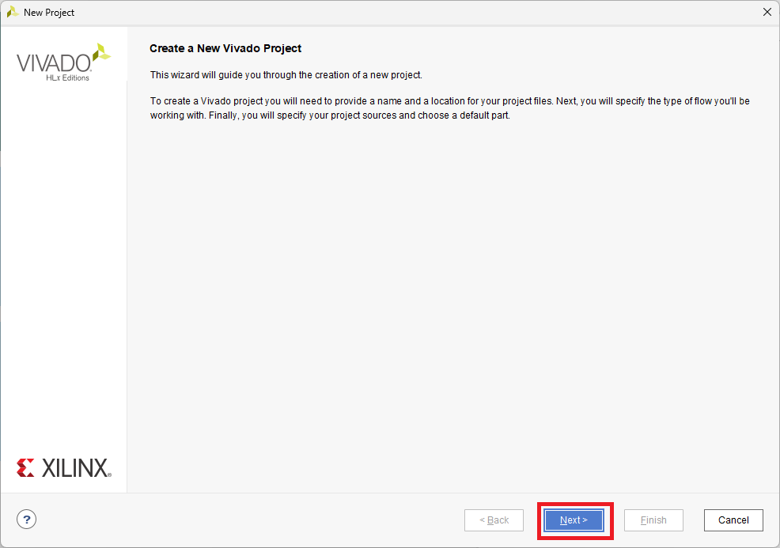  
  
自訂`Project name`和`Project location`後選`Next`。  
  
  
選擇`RTL Project`並勾選`Do not specify sources at this time`後選`Next`。  
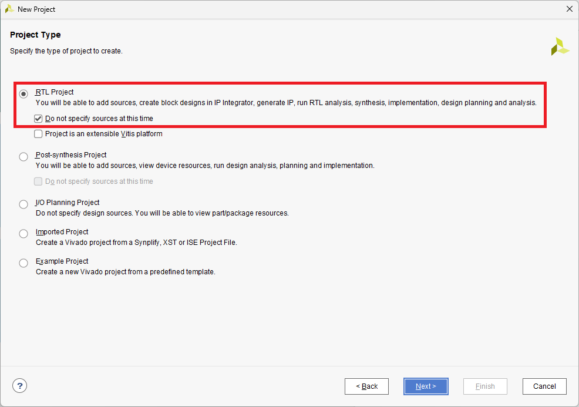  
  
選擇`Boards`選項後選擇`Zynq UltraScale+ ZCU102 Evaluation Board`後選`Next`。  
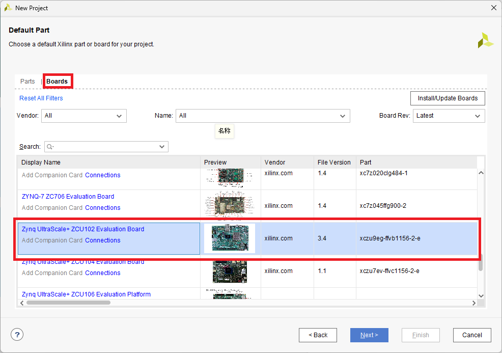  
  
點擊`Finish`。  
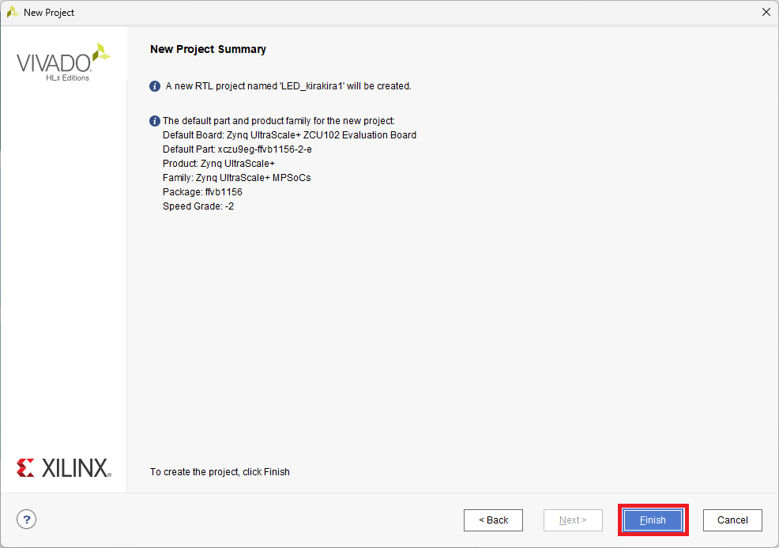  
  
## Block Design 設計  
點擊`IP INTEGRATOR`中的`Create Block Design`。  
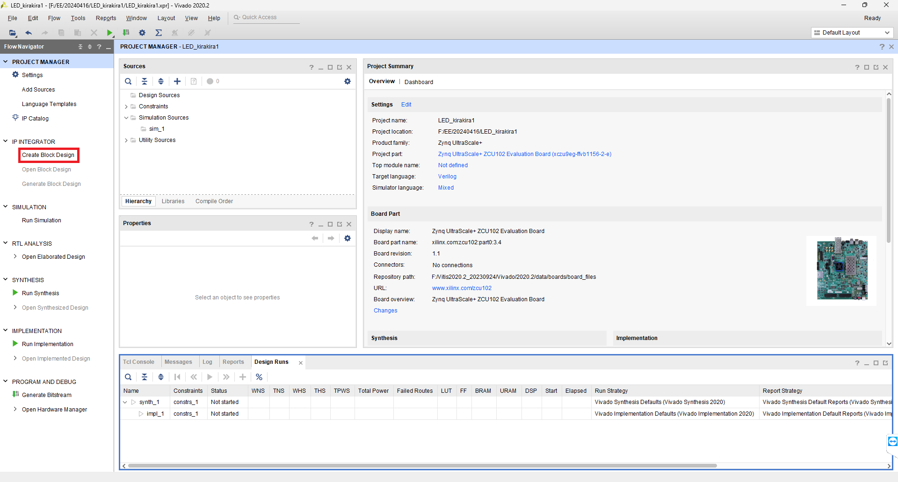  
  
自訂`Design name`後選`OK`。  
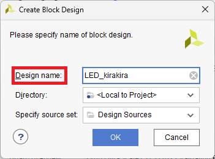  
  
在`Diagram`中`右鍵`後選擇`Add IP...`。  
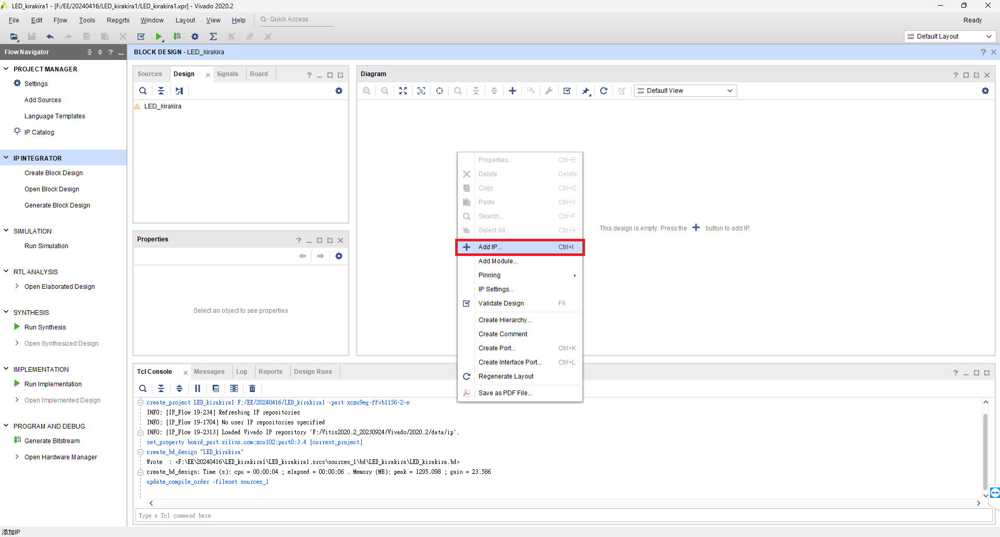  
  
左鍵雙擊選擇`Zynq UltraScale+ MPSoC`。  
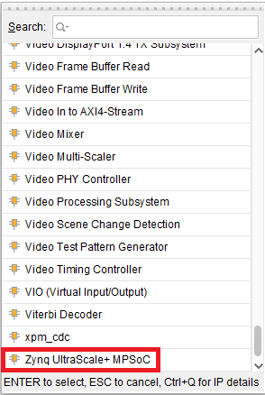  
  
再次右鍵選擇`Add IP...`左鍵雙擊新增`AXI GPIO`。  
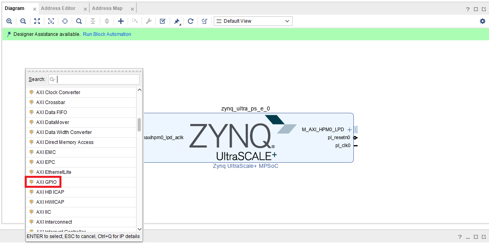  
  
此時`Diagram`圖如下。  
  
  
左鍵雙擊`axi_gpio_0`後在`Re-customize IP`把`GPIO`設置成`led 8bits`後選`OK`。    
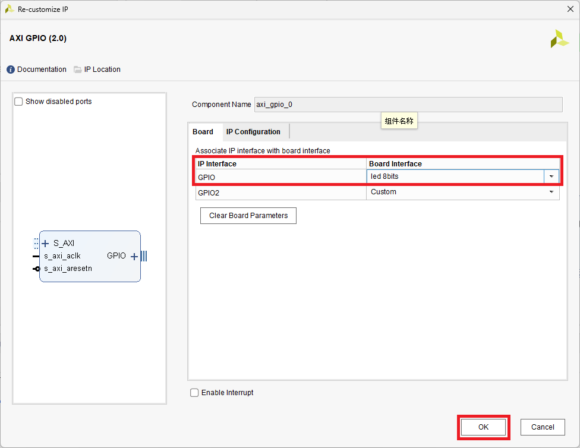  
  
點擊`Run Connection Automation`。  
  
  
勾選`All Automation`左側的格子後按`OK`。  
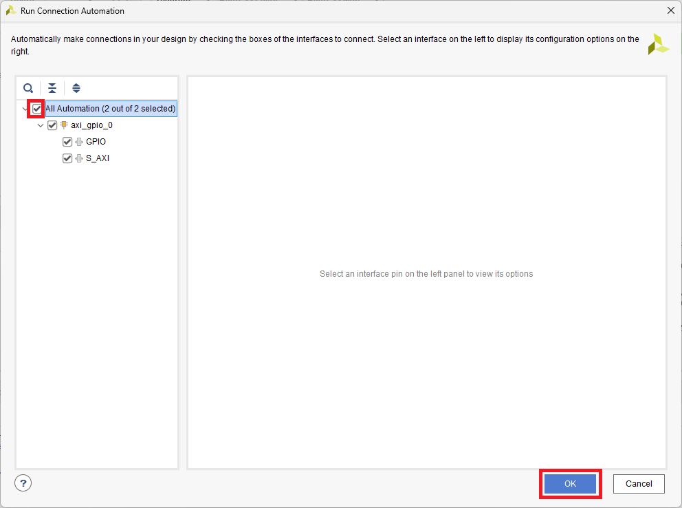  
  
此時`Diagram`內容如下。  
  
  
展開`Sources`中的`Design Sources`右鍵`LED_kirakira.bd`後選`Create HDL Wrapper...`。 ***`.bd`檔名是自己取的***  
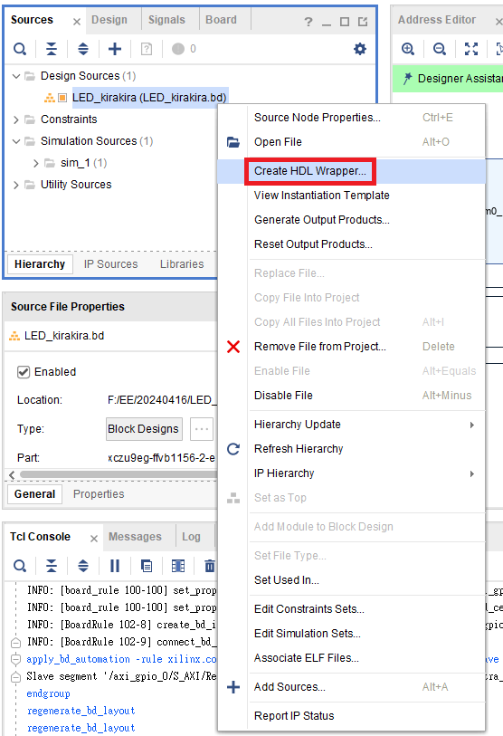  
  
選擇`Let Vivado manage wrapper and auto-update`後按`OK`。  
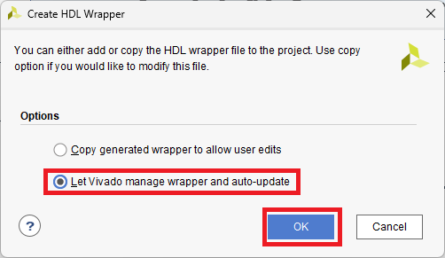  
  
等待`LED_kirakira.bd`變成`LED_kirakira_wrapper.v`檔後點擊`Generate Bitstream`。  
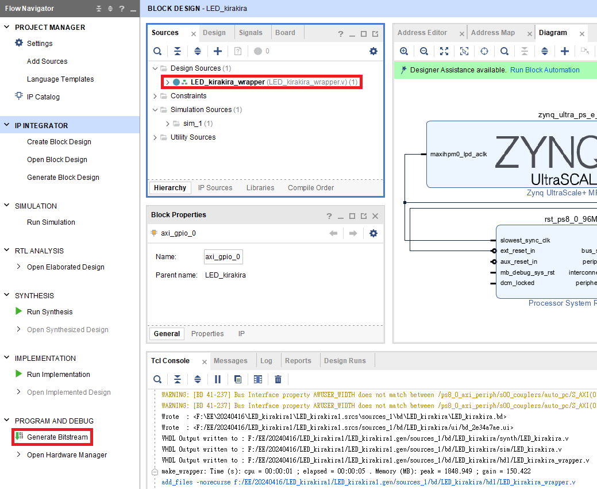  
  
`Generate Bitstream`的時間跟工程量有關，`.bit`檔完成後會出現`Bitstream Generation Completed`訊息，按`OK`繼續。  
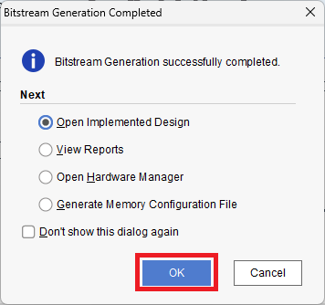  
  
在`Design Timing Summary`會顯示出設計的時間參數，沒問題就可關閉`Vivado`軟件。  
  
  
## .bit 檔和 .hwh 檔  
開啟你的`Vivado`工程檔案資料夾，`.bit`檔位於`.gen`資料夾中，`.hwh`檔位於`.runs`資料夾中。  
  
  
`.bit`檔的位置`F:\EE\20240416\LED_kirakira1\LED_kirakira1.runs\impl_1`中。  
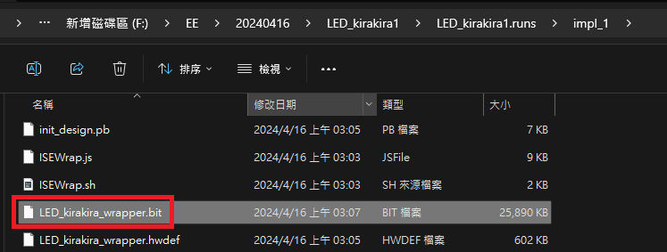  
  
`.hwh`檔的位置`F:\EE\20240416\LED_kirakira1\LED_kirakira1.gen\sources_1\bd\LED_kirakira\hw_handoff`中。  
  
  
把`.bit`檔和`.hwh`檔改成同一檔名以便後續使用。  
  

