# 第二課: 由 XDC 綁定腳位點亮 GPIO LED  
示範如何使用`.xdc`綁定腳位來操控`GPIO LED`的方法。  
  
## Vivado 工程創建  
照著第一課開啟`Vivado 2020.2`應用程式後創建新的工程。  
  
## 新增 module  
點擊`PROJECT MANAGER`中的`Add Sources`。  
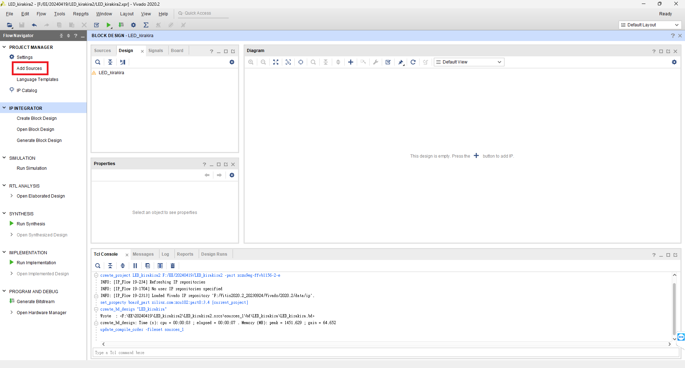  
  
在`Add Sources`頁面勾選`Add or create design sources`後按`Next`。  
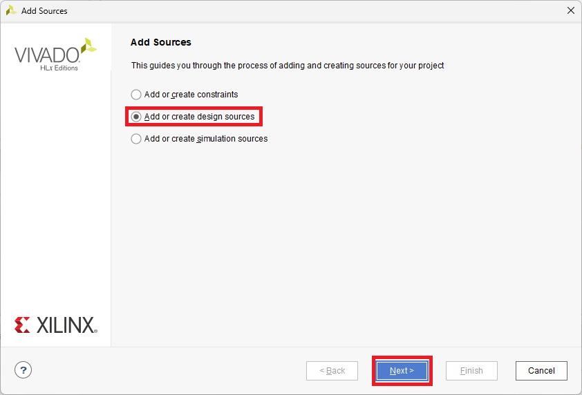  
  
按`Create File`。  
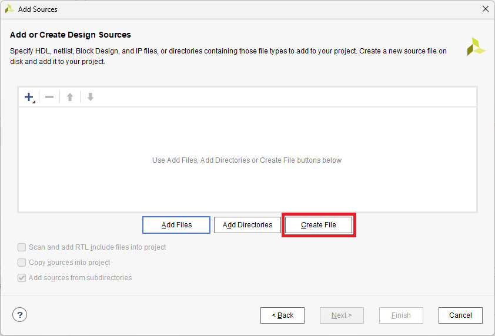  
  
填寫`File name`為`led`後按`OK`。  
  
  
按`Finish`。  
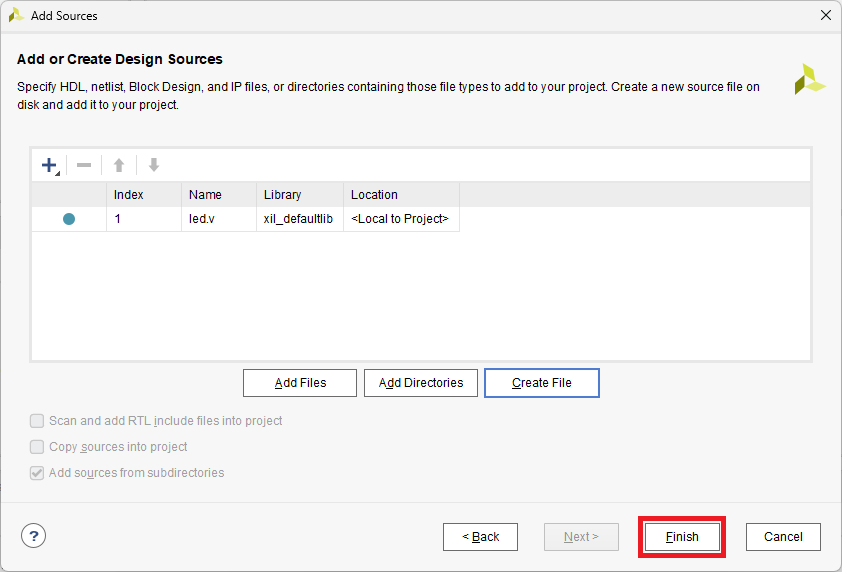  
  
在`Define Module`頁面直接按`OK`。  
  
  
按`Yes`。  
  
  
點擊`Sources`後展開`Design Sources`點擊`led.v`。  
  
  
把右邊的`led.v`檔案貼上下方程式碼後按下`儲存`按鍵。  
```v
module led(
    input [7:0] LED_in,
    output [7:0] LED_out
);

    assign LED_out = LED_in;

endmodule
```
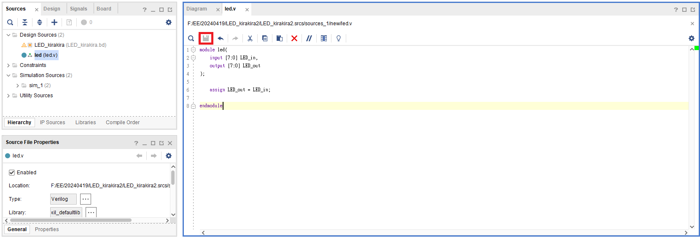  
  
## Block Design 設計  
`Create Block Design`後新增`Zynq UltraScale+ MPSoC`。  
  
  
在`Diagram`中`右鍵`後左鍵雙擊選擇`Add Module...`。  
  
  
點擊`OK`。  
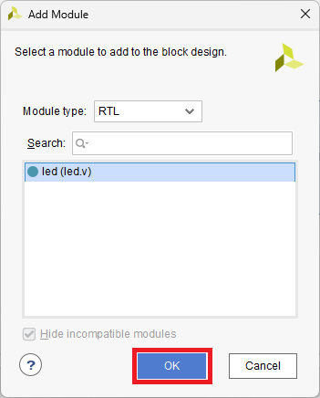  
  
此時`Diagram`如下所示。  
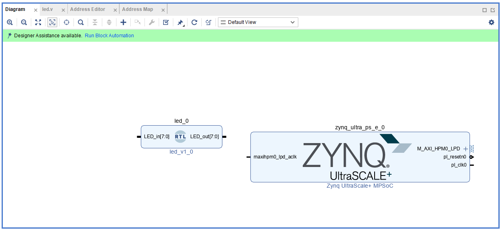  
  
左鍵選擇`led_v1_0`的`LED_out[7:0]`後右鍵選擇`Make External`選項。  
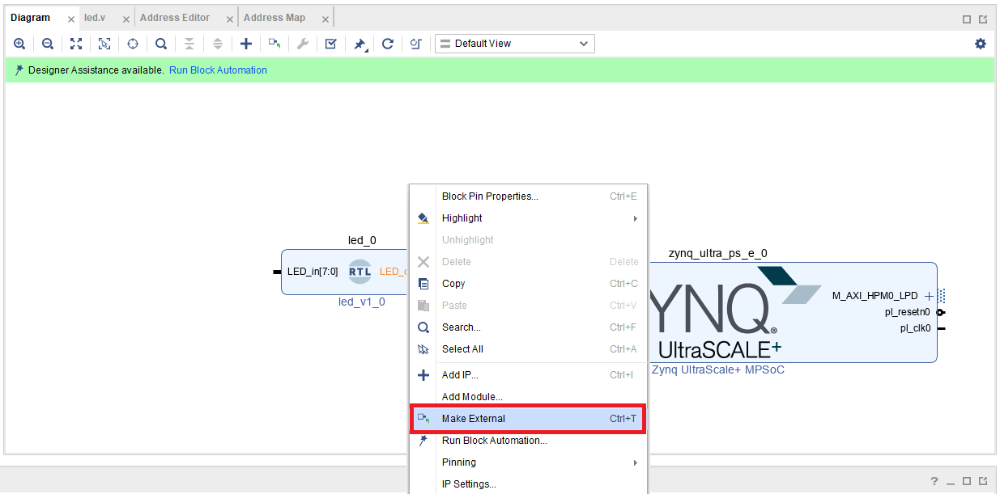  
  
左鍵選擇`LED_out_0[7:0]`可以在左邊看到`External Port Properties`視窗。  
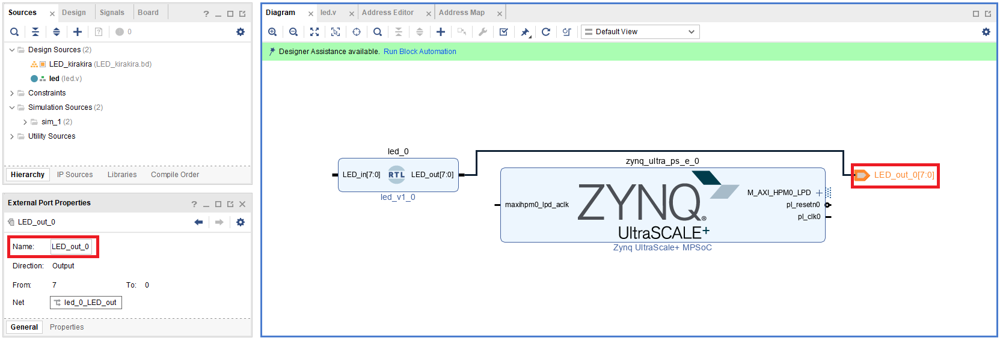  
  
把`Name`改成`LED_out`後按下`Enter`按鍵。  
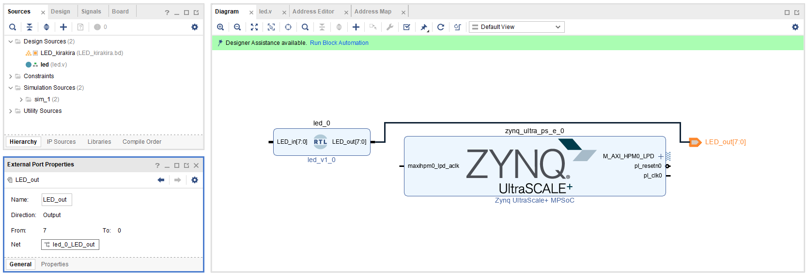  
  
新增一個`AXI GPIO`，此時`Diagram`圖如下。  
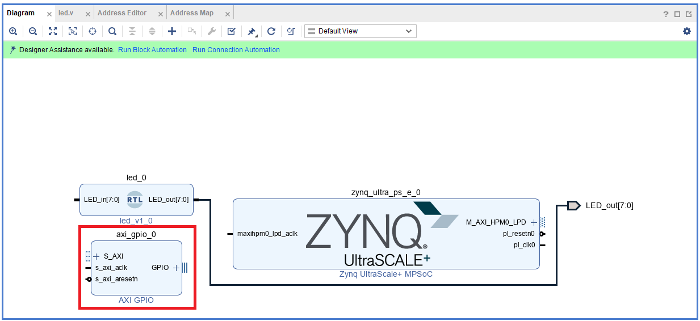  
  
左鍵雙擊`axi_gpio_0`後點`IP Configuration`。  
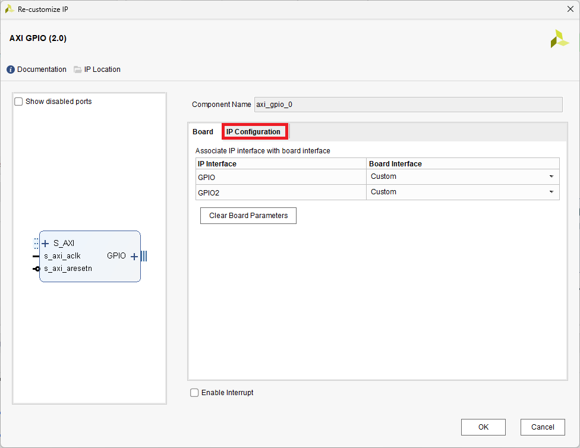  
  
`IP Configuration`的預設數據如下圖。  
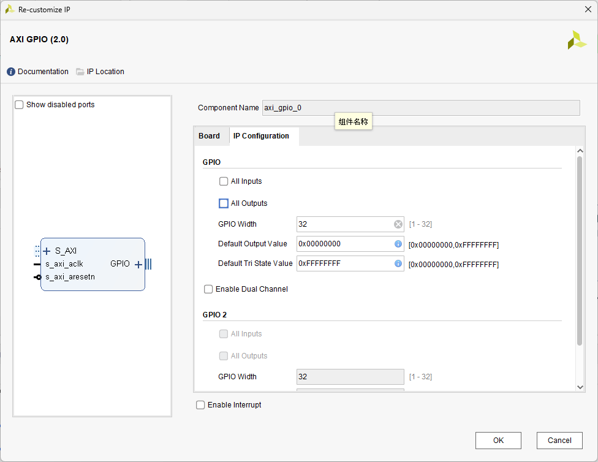  
  
勾選`All Outputs`並把`GPIO Width`改成`8`後按`OK`。  
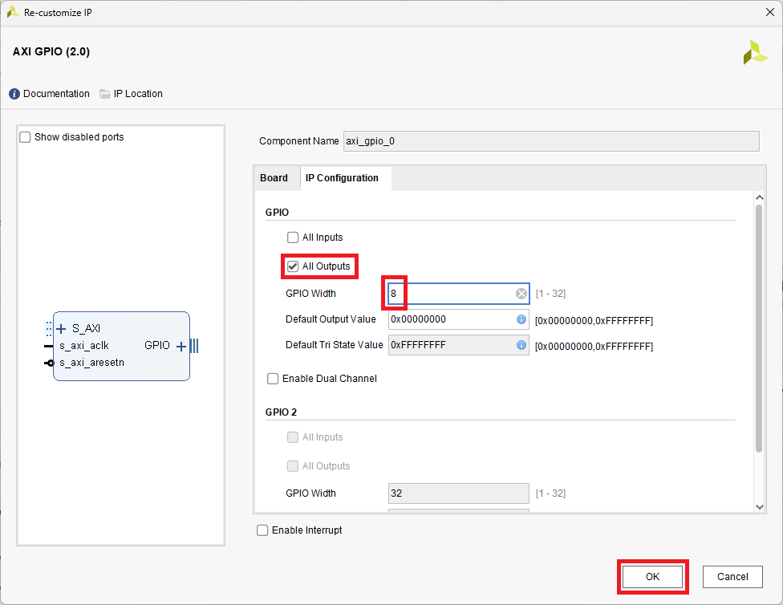  
  
在`Diagram`中點擊`axi_gpio_0`右邊`GPIO`的加號展開`GPIO`。  
  
  
將`axi_gpio_0`的`gpio_io_o[7:0]`與`led_v1_0`的`LED_in[7:0]`相連。  
**註: 鼠標靠近後會變成畫筆的樣子即可開始連接**  
  
  
點擊`Run Connection Automation`選項。  
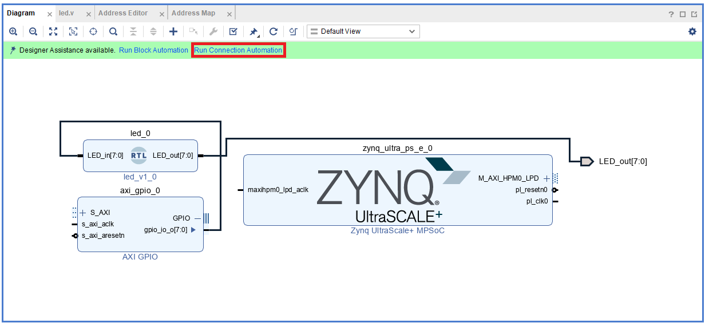  
  
選項保持預設即可，點擊`OK`。  
  
  
對於`Diagram`布局不滿意可以重新布局。  
**重新布局前:**  
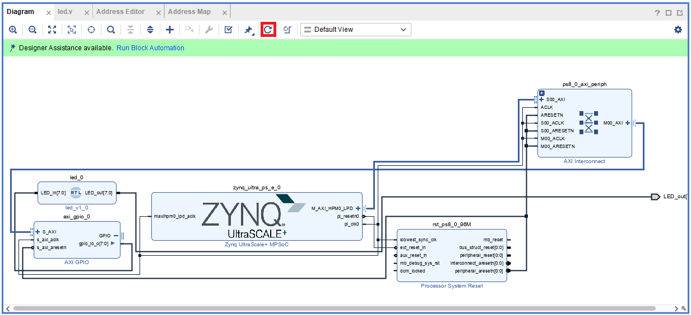  
  
**重新布局後:**
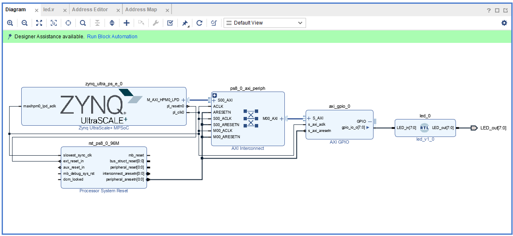  
  
## 新增 xdc 腳位  
展開`Sources`中的`Design Sources`進行`Create HDL Wrapper...`操作後再次點擊`Add Sources`。  
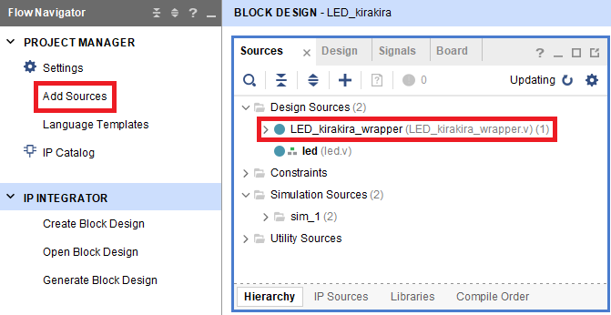  
  
在`Add Sources`頁面勾選`Add or create constraints`後按`Next`。  
  
  
按`Create File`。  
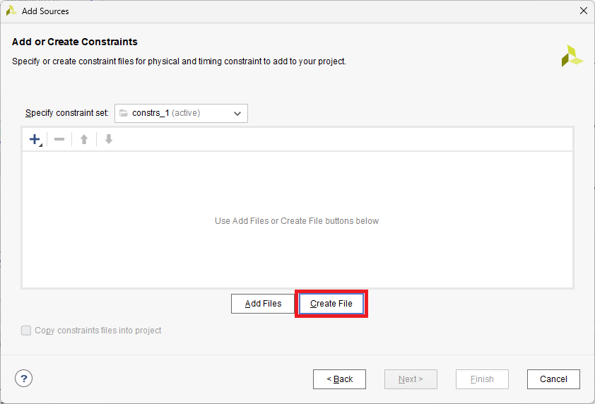  
  
填寫`File name`為`led`後按`OK`。  
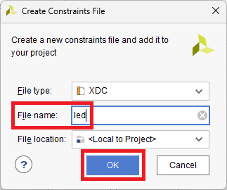  
  
按`Finish`。  
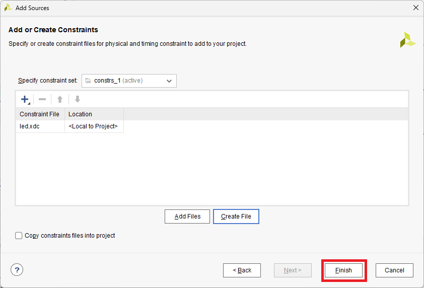  
  
在`Sources`中展開`Constraints`後點擊`led.xdc`，把右邊的`led.xdc`檔案貼上下方程式碼後按下`儲存`按鍵。  
***註: `get_ports "LED_out[0]"`中的`LED_out[0]`是`External Port`***
```text
set_property PACKAGE_PIN AG14     [get_ports "LED_out[0]"] ;
set_property IOSTANDARD  LVCMOS33 [get_ports "LED_out[0]"] ;
set_property PACKAGE_PIN AF13     [get_ports "LED_out[1]"] ;
set_property IOSTANDARD  LVCMOS33 [get_ports "LED_out[1]"] ;
set_property PACKAGE_PIN AE13     [get_ports "LED_out[2]"] ;
set_property IOSTANDARD  LVCMOS33 [get_ports "LED_out[2]"] ;
set_property PACKAGE_PIN AJ14     [get_ports "LED_out[3]"] ;
set_property IOSTANDARD  LVCMOS33 [get_ports "LED_out[3]"] ;
set_property PACKAGE_PIN AJ15     [get_ports "LED_out[4]"] ;
set_property IOSTANDARD  LVCMOS33 [get_ports "LED_out[4]"] ;
set_property PACKAGE_PIN AH13     [get_ports "LED_out[5]"] ;
set_property IOSTANDARD  LVCMOS33 [get_ports "LED_out[5]"] ;
set_property PACKAGE_PIN AH14     [get_ports "LED_out[6]"] ;
set_property IOSTANDARD  LVCMOS33 [get_ports "LED_out[6]"] ;
set_property PACKAGE_PIN AL12     [get_ports "LED_out[7]"] ;
set_property IOSTANDARD  LVCMOS33 [get_ports "LED_out[7]"] ;
```
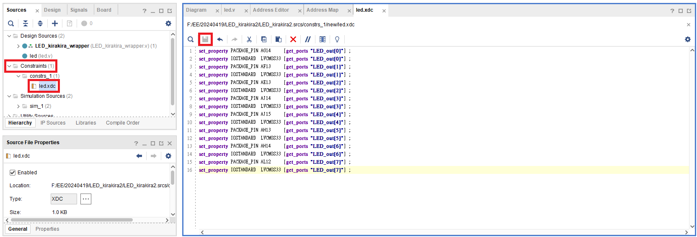  
  
## Generate Bitstream  
進行`Generate Bitstream`操作，`Save Project`視窗選`Save`。  
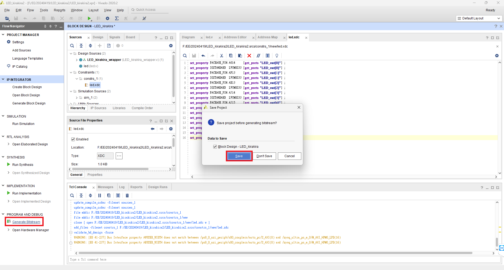  
  
在`Bitstream Generation Completed`訊息中選`View Reports`，按`OK`繼續。  
**註: 此操作將不會開啟`Implemented Design`內容，能不用等待其開啟的時間。**  
  
  
如果想看`Design Timing Summary`可以點擊`Open Implemented Design`選項，沒問題就可關閉`Vivado`軟件。  
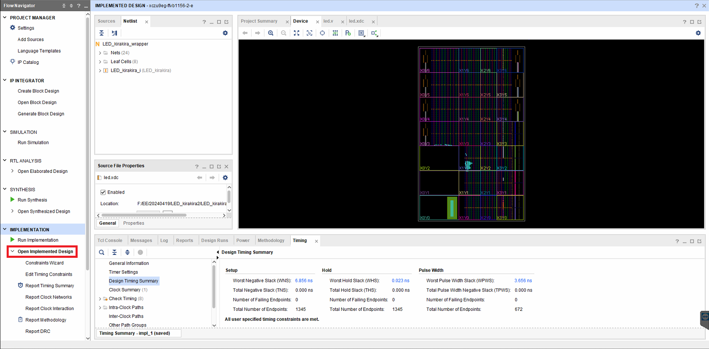  
  
## .bit 檔和 .hwh 檔  
把`.bit`檔和`.hwh`檔改成同一檔名以便後續使用。  
  

