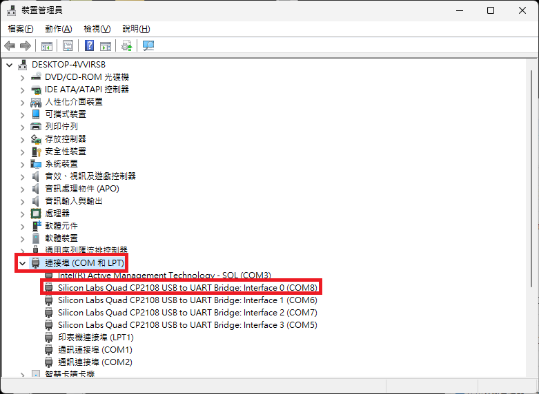
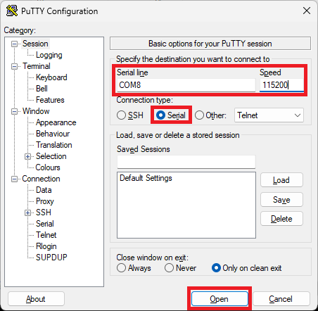
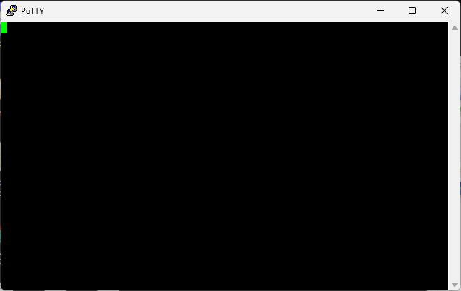
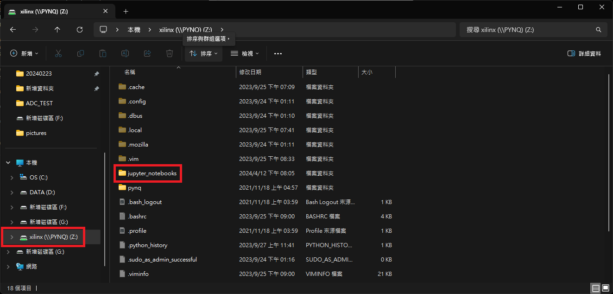
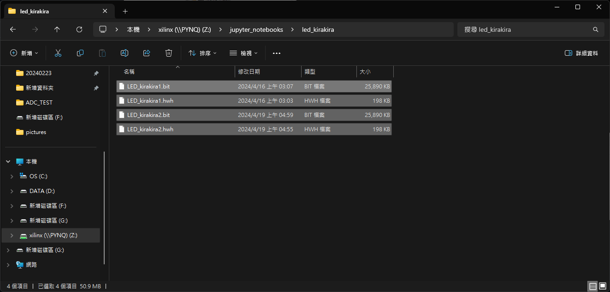
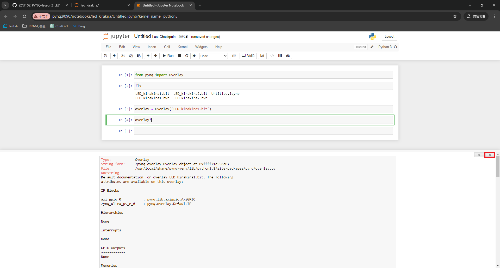
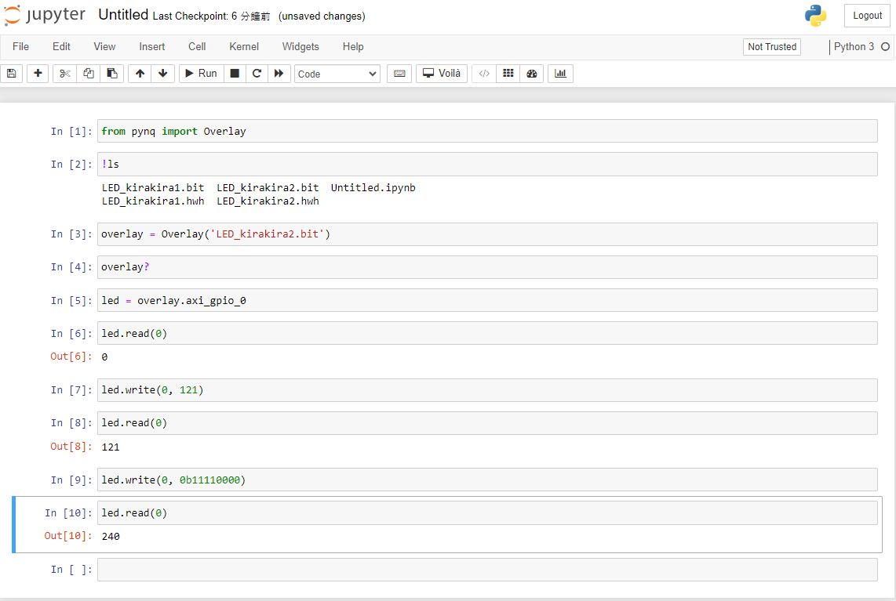
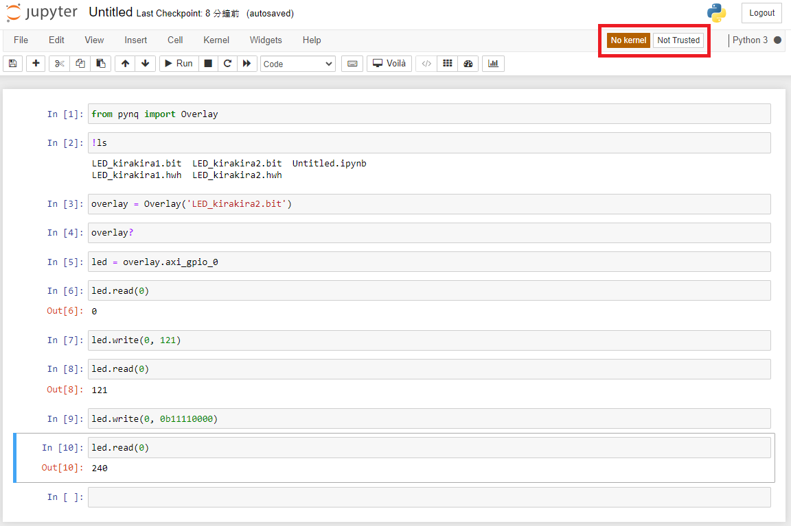

# 第三課: 由 PYNQ 載入 bit 檔點亮 GPIO LED    
示範如何使用`PYNQ`來載入`.bit`檔後操控`GPIO LED`的方法。  
  
## 確認連接埠  
在`Windows 11`的圖標上右鍵選擇`裝置管理員`。  
  
  
找到連接埠選項展開尋找`Silicon Labs Quad CP2108 USB to UART Bridge: Interface 0`，以下圖為例為`COM8`。  
  
  
## Putty 設定  
開啟`Putty`應用程式。  
  
  
選擇`Serial`選項，`Serial line`填`COM8`且`Speed`填`115200`後按`Open`。  
  
  
此時`Putty`界面如下。  
  
  
此時`ZCU102`開發版電源未開啟如下圖。  
  
  
把`ZCU102`開發版電源往上方開啟如下圖。  
  
  
此時`Putty`頁面會開始打印訊息。 **我把`Hash value`去掉了**  
  
  
等待一段時間後`Putty`頁面會顯示
```text
xilinx@pynq:~$
```
此時板子即啟動完成。  
  
  
## 檔案總管訪問 PYNQ  
在同一個局域網中可以訪問`ZCU102`的資料夾，進入`jupyter_notebooks`資料夾。  
  
  
創建`led_kirakira`資料夾。  
  
  
把`lesson 1`和`lesson 2`的`.bit`檔和`.hwh`檔放入`led_kirakira`資料夾。  
  
  
## 瀏覽器訪問 Jupyter Notebook  
在瀏覽器搜尋窗口輸入`pynq:9090`後按`Enter`鍵。  
  
  
第一次登入或無痕模式會需要輸入密碼，密碼為`xilinx`。  
  
  
登入後選擇剛剛創建的`led_kirakira`資料夾。  
  
  
## 創建 ipynb 檔案  
在`led_kirakira`資料夾點擊`New`選`Python 3`。  
  
  
此時頁面如下。  
  
  
輸入下方程式碼後利用`alt + enter`組合鍵執行程式。 **`ctrl + enter`組合鍵也能執行但不會加入下面一列的程式格**  
```python
from pynq import Overlay
```
  
  
在程式格中加入驚嘆號`!`可以執行`Linux`的指令如`ls`，範例: `!ls`。  
  
  
輸入下方程式碼載入`lesson 1`的`.bit`檔案。  
```python
overlay =  Overlay('LED_kirakira1.bit')
```
  
  
執行`overlay?`可以看到`LED_kirakira1.bit`中的一些`IP`核，不需要時可以按`x`關閉小視窗。  
  
  
輸入下方程式碼來操作`axi_gpio_0`。  
```python
led =  overlay.axi_gpio_0
```
  
  
輸入下方程式碼來讀取`axi_gpio_0`的值，結果為`0`。  
```python
led.read(0)
```
  
  
輸入下方程式碼來寫入`axi_gpio_0`的值，結果為十進制的`121`即二進制的`01111001`。  
```python
led.write(0, 121)
```
  
  
此時板子的`PL LEDs`如下圖，跟寫入的二進制`01111001`一致。  
  
  
也可以利用下方程式碼來直接寫入二進制的`10100011`。  
```python
led.write(0, 0b10100011)
```
  
  
此時板子的`PL LEDs`如下圖，跟寫入的二進制`10100011`一致。  
  
  
## Shutdown Kernal from ipynb  
不使用此`ipynb`檔案後點擊`Kernal`選`Shutdown`。  
  
  
`Shutdown kernal?`提示訊息中選`Shutdown`確認操作。  
  
  
此時右上方會顯示`No kernal`。  
  
  
點左上角`Jupyter`圖標切換至主頁面後選`Running`可以看到沒有`Notebook`執行中。  
  
  
## Shutdown Kernal from ipynb  
載入`lesson 2`的`LED_kirakira2.bit`。  
  
  
寫入二進制`11110000`後`LED`執行結果如下圖正確。  
  
  
點左上角`Jupyter`圖標切換至主頁面後選`Running`可以看到有`Notebook`執行中，點擊`Shutdown`來關閉。  
  
  
稍等一陣子後關閉完成。  
  
  
回到被結束的`ipynb`檔頁面會看到提示訊息，點`Don't Restart`。  
  
  
此時右上方會顯示`No kernal`。  
  
  
## 參考連結  
[Notebooks are not just for Python](https://pynq.readthedocs.io/en/latest/getting_started/jupyter_notebooks_advanced_features.html#Notebooks-are-not-just-for-Python)  
[AxiGPIO](https://pynq.readthedocs.io/en/latest/pynq_libraries/axigpio.html#axigpio)  