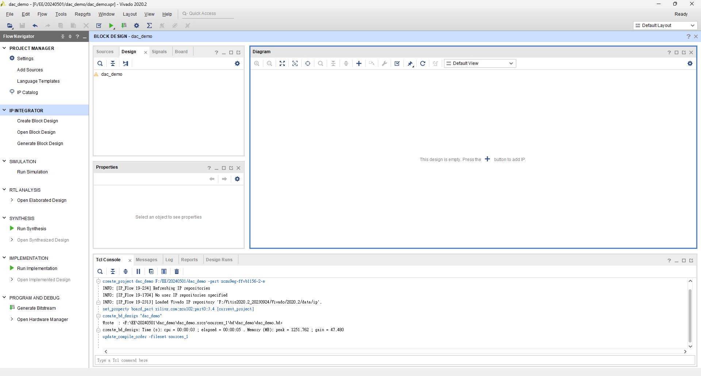
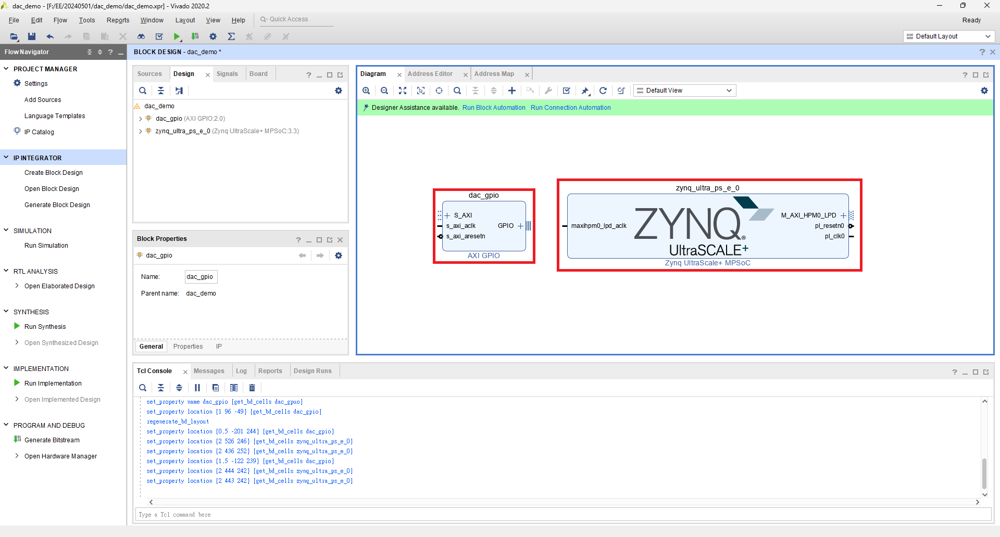
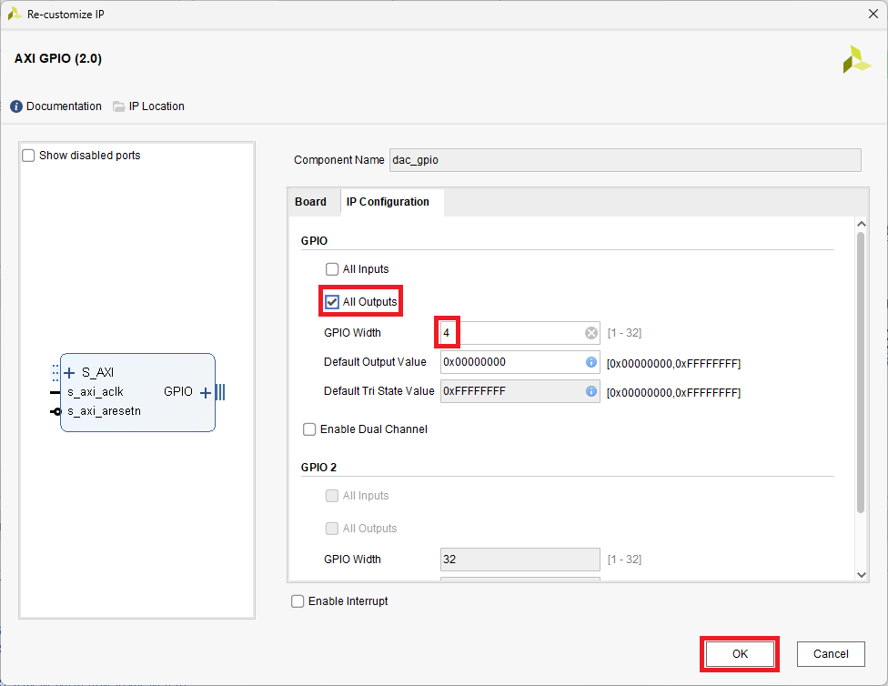
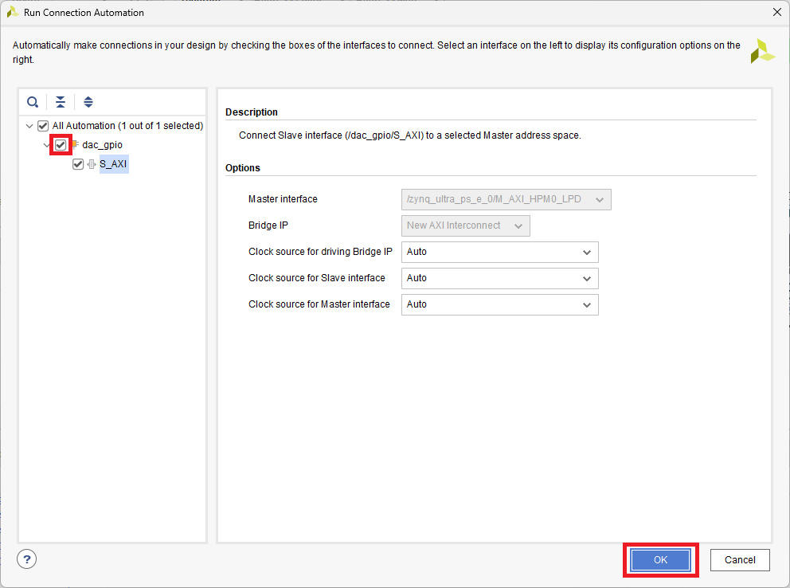
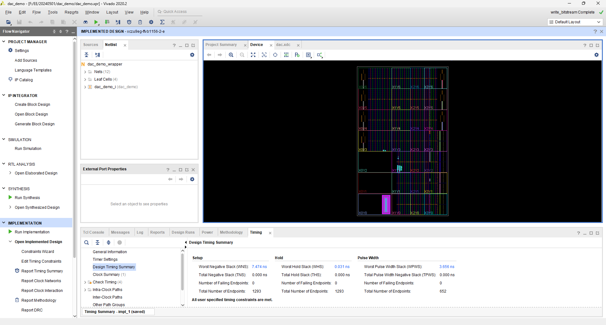
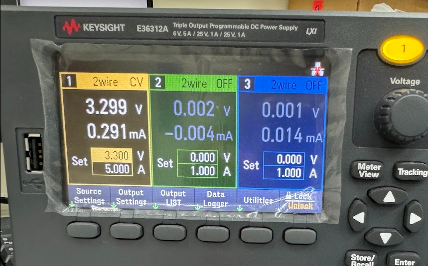
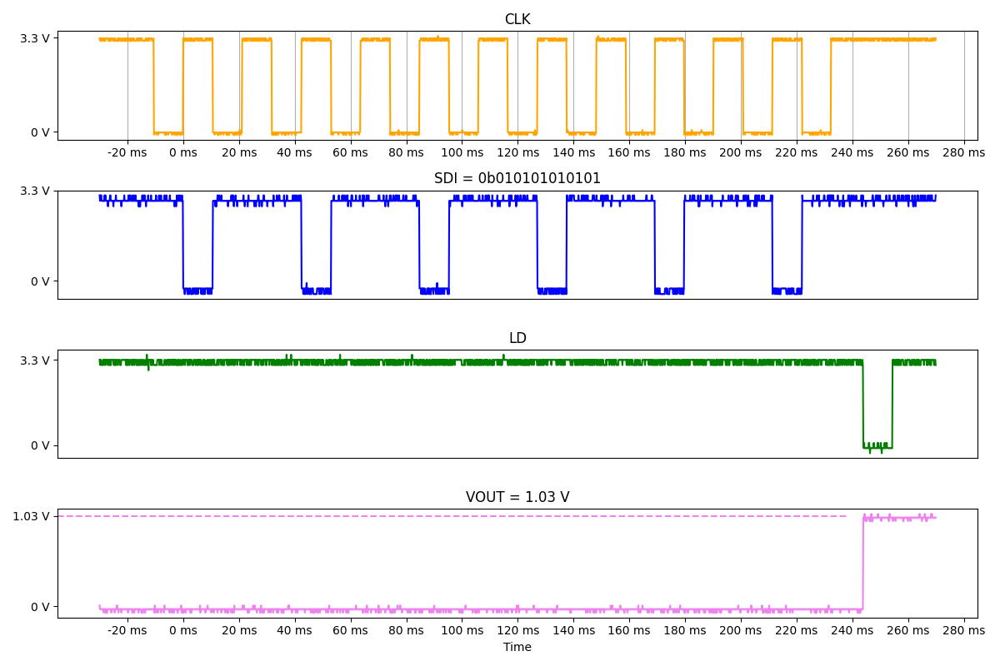
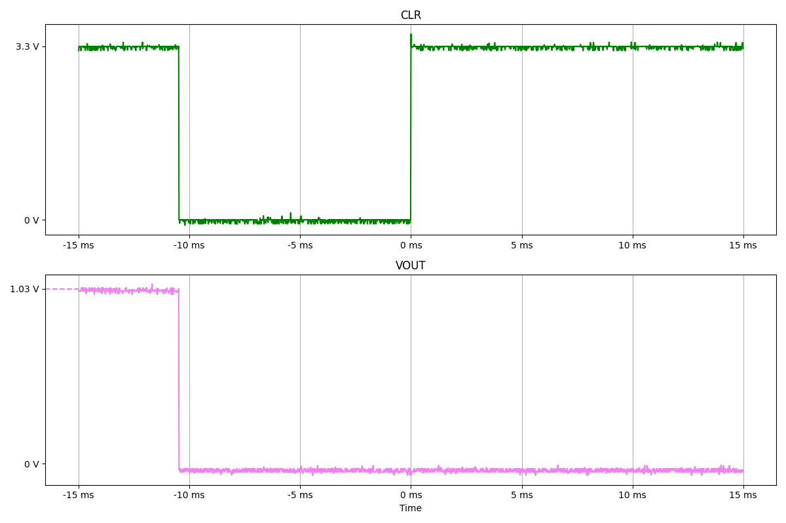

# 第四課: 由 PYNQ 寫入 GPIO 控制 DAC 輸出電壓  
示範如何使用`PYNQ`操控`GPIO`的內容控制`DAC7611P`的方法。  
  
## Vivado Project  
創建一個`dac_demo`的專案。  
  
  
在`Diagram`加入`Zynq UltraScale+ MPSoc`和`AXI GPIO`兩個`IP`，將`AXI GPIO`名稱改成`dac_gpio`。  
  
  
左鍵雙擊`AXI GPIO`，`Board`選項保持預設，至`IP Configuration`調整下列兩項:
1. `GPIO`改成`ALL Outputs`。  
2. `GPIO Width`改成`4`後按`OK`。  
  
  
  
將`dac_gpio`的`gpio_io_o[3:0]`右鍵選`Make External`。  
  
  
此時`Diagram`如下。  
  
  
進行`Run Connection Automation`，將`dac_gpio`格子勾選後按`0K`。  
  
  
`Run Connection Automation`後`Diagram`如下。  
  
  
將`dac_demo.bd`進行`Create HDL Wrapper...`操作。  
  
  
加入`dac.xdc`檔案，內容如下:
```text
set_property PACKAGE_PIN A20      [get_ports "gpio_io_o_0[0]"] ;
set_property IOSTANDARD  LVCMOS33 [get_ports "gpio_io_o_0[0]"] ;

set_property PACKAGE_PIN B20      [get_ports "gpio_io_o_0[1]"] ;
set_property IOSTANDARD  LVCMOS33 [get_ports "gpio_io_o_0[1]"] ;

set_property PACKAGE_PIN A22      [get_ports "gpio_io_o_0[2]"] ;
set_property IOSTANDARD  LVCMOS33 [get_ports "gpio_io_o_0[2]"] ;

set_property PACKAGE_PIN A21      [get_ports "gpio_io_o_0[3]"] ;
set_property IOSTANDARD  LVCMOS33 [get_ports "gpio_io_o_0[3]"] ;
```
  
  
進行`Generate Bitstream`操作。  
  
  
## DAC7611P 數位類比轉換器引腳說明  
`DAC7611P`是`12-Bit Serial Input`的數位類比轉換器 ([Data Sheet](https://www.ti.com/lit/ds/symlink/dac7611.pdf?ts=1705992052126&ref_url=https%253A%252F%252Fwww.ti.com%252Fproduct%252FDAC7611%253Futm_source%253Dgoogle%2526utm_medium%253Dcpc%2526utm_campaign%253Dasc-null-null-GPN_EN-cpc-pf-google-soas%2526utm_content%253DDAC7611%2526ds_k%253DDAC7611%2BDatasheet%2526DCM%253Dyes%2526gad_source%253D1%2526gclid%253DEAIaIQobChMI4cXXzvPygwMVbQ2DAx31BgOGEAAYASAAEgICz_D_BwE%2526gclsrc%253Daw.ds))，示範的封裝為`PDIP-8`，引腳功能如下表:  
|Pin|符號|說明|
|:--:|:--:|:---|
|1|VDD|電源輸入。示範時接 + 3.3 V，額外接上 0.1 μF 和 10 μF 的去耦電容|
|2|CS|Chip Select (active LOW)，示範時接地|
|3|CLK|Serial Data Input 的時鐘訊號|
|4|SDI|在時鐘訊號上升沿將 Serial Data Input 載入 internal serial register|
|5|LD|Logic 0 時載入 Internal DAC Register 內容，不論 CS 或 CLK 的狀態|
|6|CLR|Logic 0 時 register 變成 000H 且輸出電壓 VOUT 為 0 V|
|7|GND|地|
|8|VOUT|輸出電壓|
  
## 電路接線圖  
麵包版接線如下，`IC`缺口在上時左上方第一腳為`Pin 1`，逆時針依序增加。  
  
  
電源供應由`E36312A`的`Channel 1`輸出提供。  
  
  
參考`dac.xdc`將`CLK`、`SDI`、`LD`和`CLR`連接至`ZCU102`的`PMOD GPIO Headers J55`。  
1. `CLK`連接到`PMOD0_3`(A21)  
2. `SDI`連接到`PMOD0_2`(A22)  
3. `LD`連接到`PMOD0_1`(B20)  
4. `CLR`連接到`PMOD0_0`(A20)  
  
  
  
## PYNQ 程式碼  
參考`dac_demo.ipynb`內容，這次需要引入`time`模組。
```python
import time
from pynq import Overlay

overlay = Overlay('dac_demo.bit')
```
  
首先資料給`101010101010`，理論值為`2.2 V`。  
```python
DATA = 0b101010101010
print(f"Decimal representation: {int(DATA)}")
print(f"DAC voltage is {3.3*int(DATA)/int(0b111111111111)} V")
type(DATA)
```

執行結果:  
```text
Decimal representation: 2730
DAC voltage is 2.2 V

int
```
  
將控制訊號由`Python`控制: ***註: 最好先改 SDI 後再把 CLK 上拉但我不想改了***
```python
overlay.dac_gpio.write(0, 0b1111) # 四個訊號為 logic 1

# 把資料丟入暫存器
for i in range(12):
    time.sleep(0.001) # 停頓 1 ms
    overlay.dac_gpio.write(0, 0b0111) # CLK 訊號變成 logic 0
    time.sleep(0.001)
    if i % 2 == 1:
        overlay.dac_gpio.write(0, 0b1011) # SDI into register
    else:
        overlay.dac_gpio.write(0, 0b1111) # SDI into register

overlay.dac_gpio.write(0, 0b1101) # LD 訊號變成 logic 0，將暫存器資料進行載入
time.sleep(0.001)
overlay.dac_gpio.write(0, 0b1111) # 四個訊號為 logic 1
```
  
利用`MSO-X 3014T`示波器觀察並將`CSV`檔案作圖如下:  
  
  
再來進行清除暫存器動作。  
```python
overlay.dac_gpio.write(0, 0b1110) # Clear DATA
time.sleep(0.001)
overlay.dac_gpio.write(0, 0b1111)
```
  
  
再來資料給`010101010101`，理論值為`1.1 V`。  
```python
DATA = 0b010101010101
print(f"Decimal representation: {int(DATA)}")
print(f"DAC voltage is {3.3*int(DATA)/int(0b111111111111)} V")
```
  
執行結果:  
```text
Decimal representation: 1365
DAC voltage is 1.1 V
```
  
`Python`程式:
```python
overlay.dac_gpio.write(0, 0b1111) # 四個訊號為 logic 1

# 把資料丟入暫存器
for i in range(12):
    time.sleep(0.001) # 停頓 1 ms
    overlay.dac_gpio.write(0, 0b0111) # CLK 訊號變成 logic 0
    time.sleep(0.001)
    if i % 2 == 1:
        overlay.dac_gpio.write(0, 0b1111) # SDI into register
    else:
        overlay.dac_gpio.write(0, 0b1011) # SDI into register

overlay.dac_gpio.write(0, 0b1101) # LD 訊號變成 logic 0，將暫存器資料進行載入
time.sleep(0.001)
overlay.dac_gpio.write(0, 0b1111) # 四個訊號為 logic 1
```
  
`CSV`檔案作圖如下:  
  
  
再來進行清除暫存器動作。  
```python
overlay.dac_gpio.write(0, 0b1110) # Clear DATA
time.sleep(0.001)
overlay.dac_gpio.write(0, 0b1111)
```
  
  
## GPIO 速度問題  
從圖`17.png`中可發現`CLR`訊號維持在`低電位`不只`1 ms`，這是由於`Python`是依序執行程式且其執行需要時間的關係。  
  
## 參考連結  
[DAC7611P](https://www.mouser.tw/ProductDetail/Texas-Instruments/DAC7611P?qs=vul0MlC%2Fa1exrBAtSLlcNA%3D%3D)  
[Data Sheet](https://www.ti.com/lit/ds/symlink/dac7611.pdf?ts=1705992052126&ref_url=https%253A%252F%252Fwww.ti.com%252Fproduct%252FDAC7611%253Futm_source%253Dgoogle%2526utm_medium%253Dcpc%2526utm_campaign%253Dasc-null-null-GPN_EN-cpc-pf-google-soas%2526utm_content%253DDAC7611%2526ds_k%253DDAC7611%2BDatasheet%2526DCM%253Dyes%2526gad_source%253D1%2526gclid%253DEAIaIQobChMI4cXXzvPygwMVbQ2DAx31BgOGEAAYASAAEgICz_D_BwE%2526gclsrc%253Daw.ds)  