# 第五課: 由 Clocking Wizard 創造時鐘訊號及 PYNQ 檔案限制  
示範如何使用`Clocking Wizard`創造時鐘訊號，和`PYNQ`的`.bit`檔限制。  
  
## Vivado Project 1  
創建一個`gpio_clk`的專案，新增`Block Diagram`，按`Add Sources`選項點擊`Add Files`。  
  
  
選擇`freq_divide_10.v`後按`OK`。  
```v
module freq_div_10(
    input clk, reset,
    output reg clk_div_10
);
    // Define a 4-bit counter to keep track of the division.
    reg [3:0]counter4;

    // This always block triggers on the rising edge of the 'clk' signal or a low-level 'reset' signal.
    always @(posedge clk or negedge reset) begin
        // If 'reset' is active (low), reset the counter to zero.
        if (!reset)
            counter4 <= 4'b0;
        // If the counter reaches 4, reset it to zero.
        else if (counter4 == 4'd4)
            counter4 <= 4'b0;
        // If none of the above conditions are met, increment the counter by 1.
        else
            counter4 <= counter4 + 1'b1;
    end

    // This always block also triggers on the rising edge of 'clk' or a low-level 'reset' signal.
    always @(posedge clk or negedge reset) begin
        // If 'reset' is active (low), the output signal 'clt_div_10' follows the 'clk' input.
        if (!reset)
            clk_div_10 <= 1'b0;
        // If the counter reaches 4, toggle the output signal 'clt_div_10'.
        else if (counter4 == 4'd4)
            clk_div_10 <= ~clk_div_10;
        // If none of the above conditions are met, the output signal 'clt_div_10' follows the 'clk' input.
        else
            clk_div_10 <= clk_div_10;
    end

endmodule
```
  
  
點擊`Finish`。  
  
  
在`Block Diagram`中新增一個`freq_div_10`的`module`。  
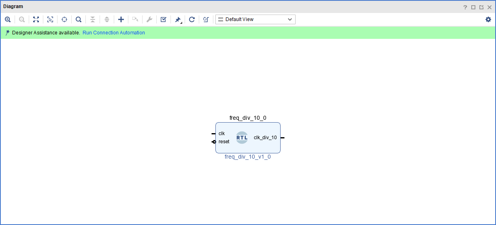  
  
新增`Clocking Wizard`的`IP`。  
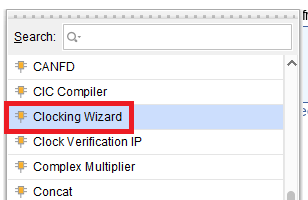  
  
此時`Block Diagram`如下。  
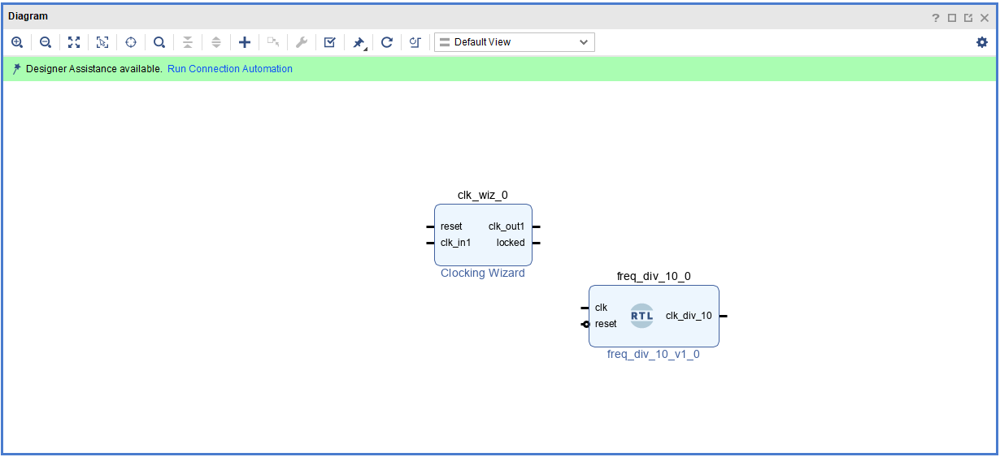  
  
左鍵雙擊`clk_wiz_0`並在`Board`選項中將`CLK_IN1`改成`user si570 sysclk`。  
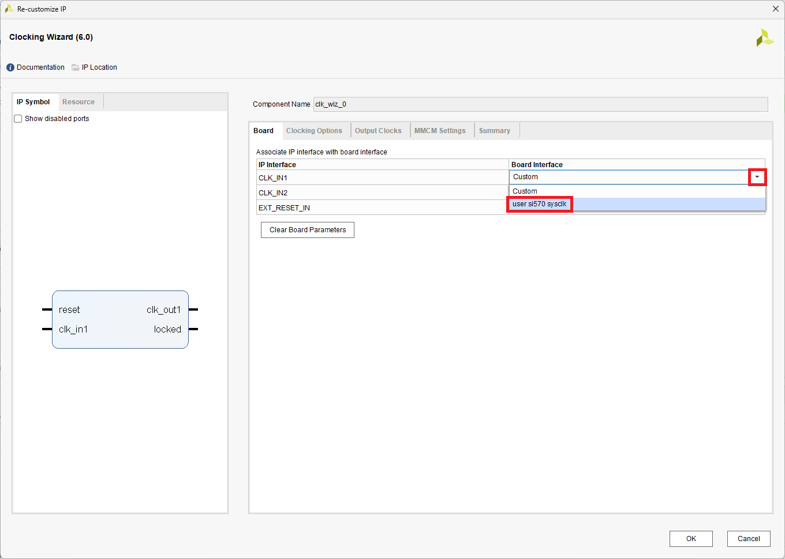  
  
選擇`Output Clocks`選項。  
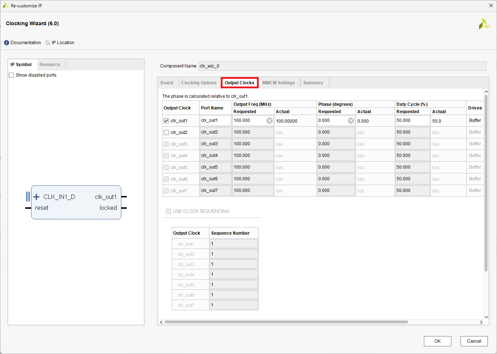  
  
將`clk_out1`的`Port Name`改成`clk_10M`，`Requested Output Freq`改成`10.000`。  
***參考[ZCU102 Evaluation Board User Guide (UG1182)](https://docs.amd.com/v/u/en-US/ug1182-zcu102-eval-bd)第 47 頁可知`user si570 sysclk`頻率範圍為`10 MHz`到`810 MHz`。***  
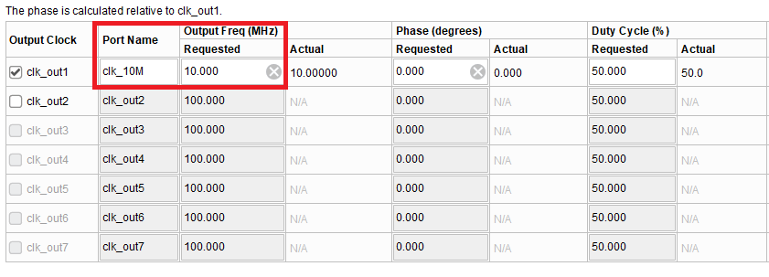  
  
將`Output Clocks`頁面下滑，把`Enable Optional Inputs...`中的`reset`取消勾選後按`OK`。  
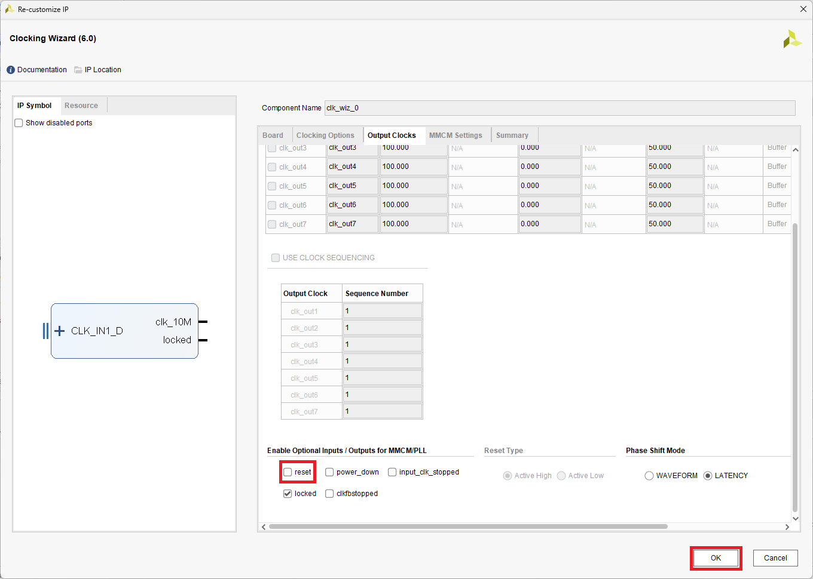  
  
將`Block Diagram`進行下圖的連接。  
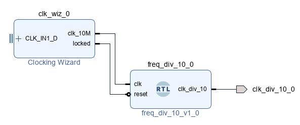  
  
進行`Run Connection Automation`，保持預設按`OK`。  
  
  
此時`Block Diagram`如下圖。  
  
  
進行`Create HDL Wrapper...`後點擊`Add Sources`選項中的`Add Files`。  
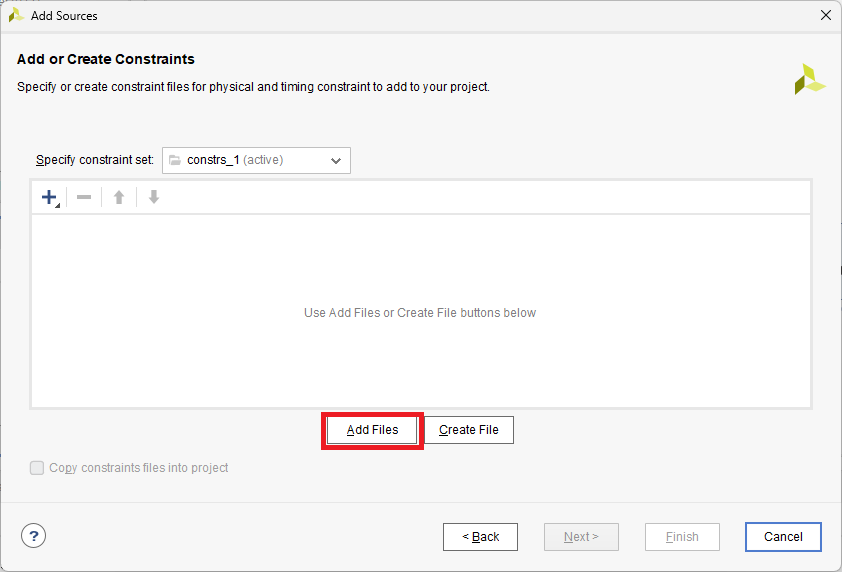  
  
選擇`clk.xdc`後按`OK`。  
```text
set_property PACKAGE_PIN A20      [get_ports "clk_div_10_0"] ;
set_property IOSTANDARD  LVCMOS33 [get_ports "clk_div_10_0"] ;
```
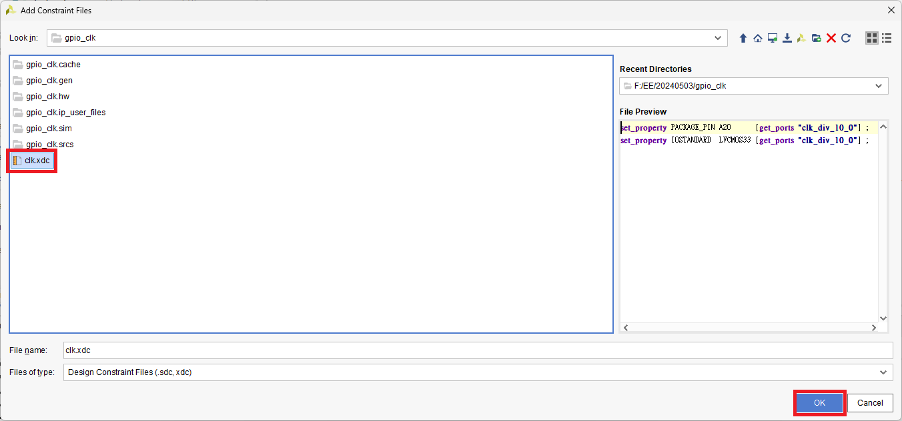  
  
點擊`Finish`。  
  
  
進行`Generate Bitstream`操作，`.bit`檔取名為`gpio_clk_1.bit`。  
  
  
## 在 PYNQ 中載入 Vivado Project 1 的 .bit 檔  
在`Jupyter Notebook`中載入`gpio_clk_1.bit`，此時發生錯誤如圖。  
  
  
錯誤訊息:  
```text
---------------------------------------------------------------------------
KeyError                                  Traceback (most recent call last)
<ipython-input-3-4f1916faaf9b> in <module>
----> 1 overlay = Overlay('gpio_clk_1.bit')

/usr/local/share/pynq-venv/lib/python3.8/site-packages/pynq/overlay.py in __init__(self, bitfile_name, dtbo, download, ignore_version, device)
    352 
    353         if download:
--> 354             self.download()
    355 
    356         self.__doc__ = _build_docstring(self._ip_map._description,

/usr/local/share/pynq-venv/lib/python3.8/site-packages/pynq/overlay.py in download(self, dtbo)
    418                     Clocks.set_pl_clk(i)
    419 
--> 420         super().download(self.parser)
    421         if dtbo:
    422             super().insert_dtbo(dtbo)

/usr/local/share/pynq-venv/lib/python3.8/site-packages/pynq/bitstream.py in download(self, parser)
    185 
    186         """
--> 187         self.device.download(self, parser)
    188 
    189     def remove_dtbo(self):

/usr/local/share/pynq-venv/lib/python3.8/site-packages/pynq/pl_server/embedded_device.py in download(self, bitstream, parser)
    596             fd.write(bitstream.binfile_name)
    597 
--> 598         self.set_axi_port_width(parser)
    599 
    600         self._xrt_download(parser.xclbin_data)

/usr/local/share/pynq-venv/lib/python3.8/site-packages/pynq/pl_server/embedded_device.py in set_axi_port_width(self, parser)
    560             # Setting port widths not supported for xclbin-only designs
    561             return
--> 562         parameter_dict = parser.ip_dict[parser.ps_name]['parameters']
    563         if parser.family_ps == 'zynq_ultra_ps_e':
    564             for para in ZU_FPD_SLCR_REG:

KeyError: ''
```
  
要解決此錯誤要在`Block Diagram`中加入`Zynq UltraScale+ MPSoC`的`IP`。  
  
## Vivado Project 2  
把`gpio_clk`的專案重新開啟，新增`Zynq UltraScale+ MPSoC`和`AXI GPIO`選擇點亮`LED`的預設功能。  
***註: 直接在`Block Diagram`中新增，完成後進行存檔。***  
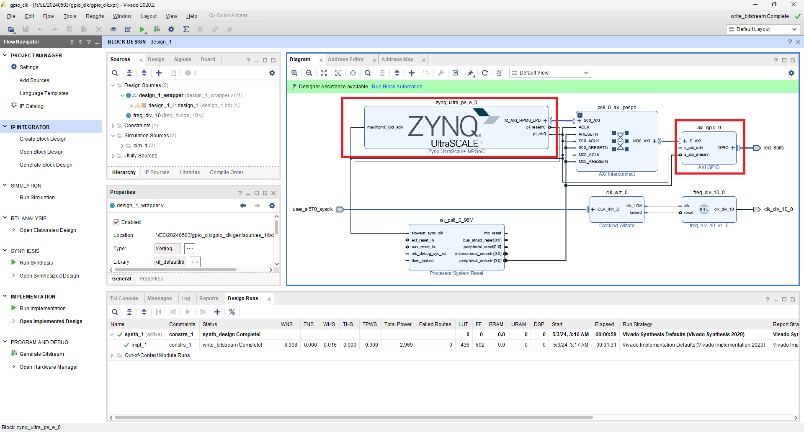  
  
進行`Generate Bitstream`操作，`.bit`檔取名為`gpio_clk_2.bit`。  
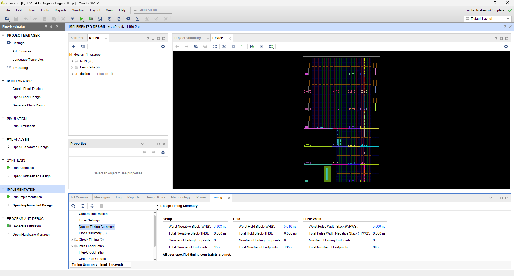  
  
## 在 PYNQ 中載入 Vivado Project 2 的 .bit 檔  
在`Jupyter Notebook`中載入`gpio_clk_2.bit`，此時無錯誤了。  
  
  
## 示波器波形觀測  
示波器資料位於`scope`資料夾中，將`CSV`檔作圖可得下圖。  
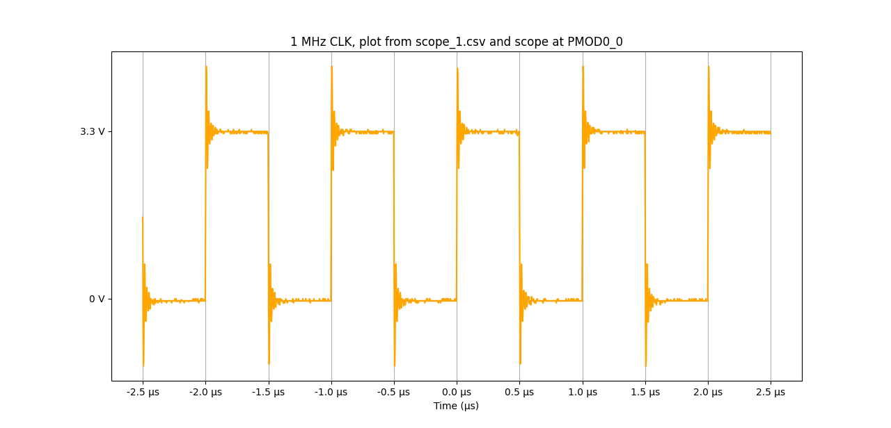  
  
頻率為`1 MHz`，為`10 MHz`除頻後的結果。  
  
## 參考連結  
[Clocking Wizard](https://www.xilinx.com/products/intellectual-property/clocking_wizard.html)  