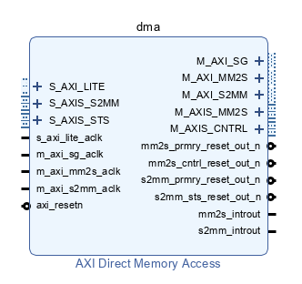
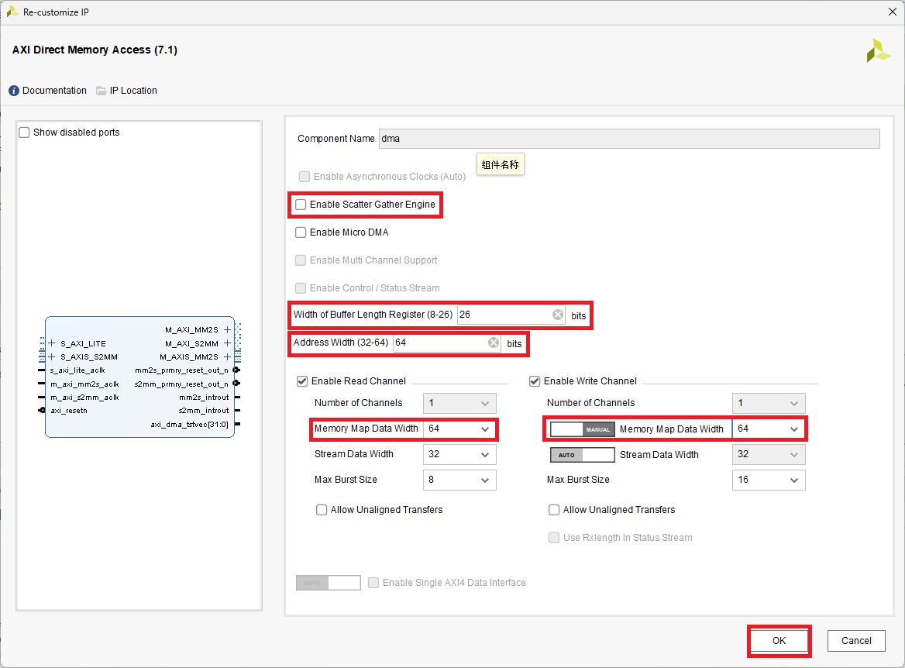
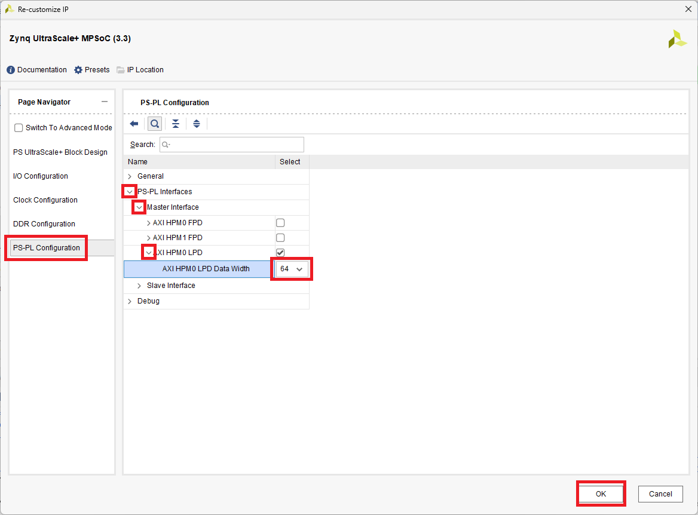
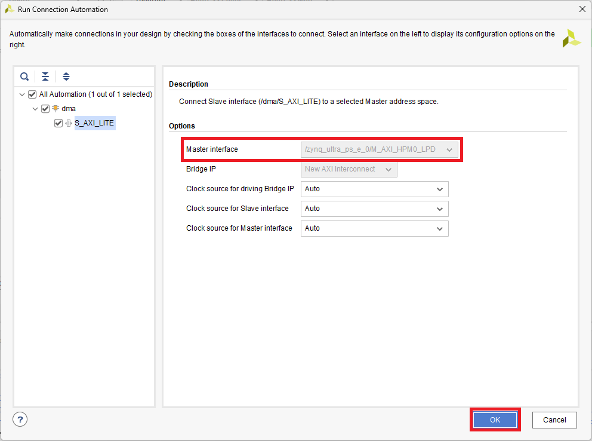
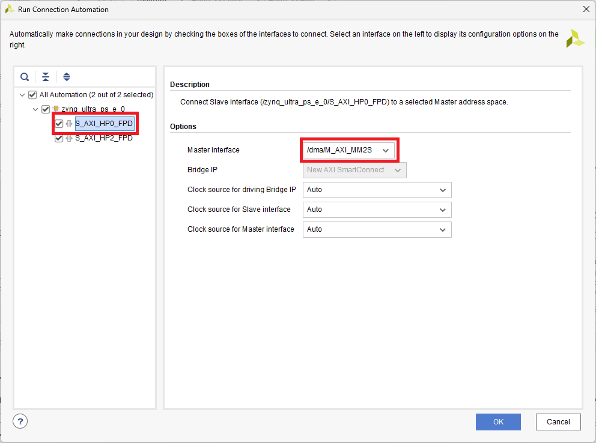
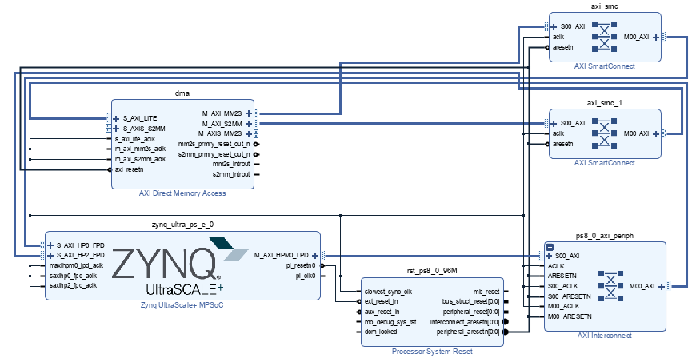
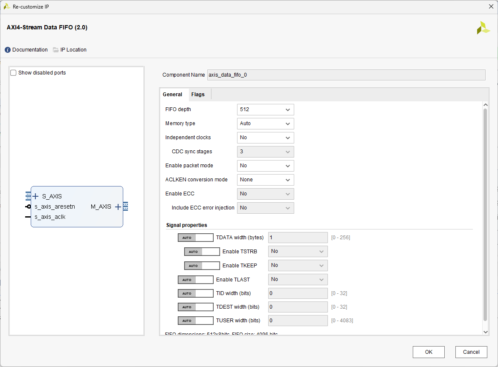

# 第六課: PYNQ DMA 範例  
參考論壇的[PYNQ DMA tutorial (Part 1: Hardware design)](https://discuss.pynq.io/t/tutorial-pynq-dma-part-1-hardware-design/3133)和[PYNQ DMA tutorial (Part 2: Using the DMA from PYNQ)](https://discuss.pynq.io/t/tutorial-pynq-dma-part-2-using-the-dma-from-pynq/3134)。  
  
兩個原本是針對`PYNQ-Z2`的，我按照我的理解改成`ZCU102`的。  
  
# PYNQ DMA tutorial (Part 1: Hardware design)
## Vivado project  
新建`Vivado project`，在`block diagram`中新增`Zynq UltraScale+ MPSoC`，如圖中的`zynq_ultra_ps_e_0`。  
  
  
新增`AXI Direct Memory Access`，`AXI IP`的名稱能在`Python`中看見，將預設的`axi_dma_0`改名成`dma`。  
  
  
左鍵雙擊`DMA`開啟設定頁面。  
1. 將`Enable Scatter Gather Engine`選項取消勾選。  
2. 把`Width of Buffer Length Register`設置成`26`。  
3. 把`Address width`設置成`64`。  
4. 將`memory mapped data width`設定為`64`，以符合`HP port`。  
5. 將`stream data width`設定為與`IP`的`stream width`相符。在這個範例中，設定為`32`。  
6. 可以增加`burst width`以提高資料傳輸的效率。通常增加`max burst size`時，硬體資源的使用率會略有增加。  
7. 確保未啟用`Allow unaligned transfers`，`PYNQ`中不支援。  
  
按`OK`保存`DMA`設置。  
  
  
左鍵雙擊`Zynq UltraScale+ MPSoC`開啟設定頁面，前往`PS-PL Configuration`配置，展開`PS-PL Interfaces`的`Master Interface`。  
將`AXI HPM0 LPD`選項展開把`AXI HPM0 LPD Data Width`改成`64`後按`OK`。  
  
  
執行`Run connection automation`顯示對話框，確認`S_AXI_LITE`連接到`/zynq_ultra_ps_e_0/M_AXI_HPM0_LPD`後按`OK`，此為`DMA`的`control port`。  
  
  
此時`Diagram`如下:  
  
  
`DMA`的`AXI master ports`需要連接到`PS DRAM`，左鍵雙擊`Zynq UltraScale+ MPSoC`開啟設定頁面，前往`PS-PL Configuration`配置，展開`Slave Interface`中的`AXI HP`並啟用`AXI HP0 FPD`和`AXI HP2 FPD`。  
  
展開`AXI HP0 FPD`和`AXI HP2 FPD`並檢查`Data Width`是否設定為`64`後按`OK`。  
  
  
執行`Run Connection Automation`選項。  
1. 選擇`S_AXI_HP0_FPD`，對於`Master Interface`選擇`/dma/M_AXI_MM2S`。  
  
2. 選擇`S_AXI_HP2_FPD`，對於`Master Interface`選擇`/dma/M_AXI_S2MM`。  
3. 按`OK`選項。  
  
  
現在只剩下`DMA`的`AXI Stream ports`還未連接。  
  
  
新增`IP`核`AXI4-Stream Data FIFO`，使用`FIFO`的預設設定。  
  
  
  
進行以下的連接:
1. `DMA`的`M_AXIS_MM2S`連接到`axis_data_fifo_0`的`S_AXIS`。  
2. `DMA`的`S_AXIS_S2MM`連接到`axis_data_fifo_0`的`M_AXIS`。  
3. `axis_data_fifo_0`的`s_axis_aclk`連接到`Zynq UltraScale+ MPSoC`的`pl_clk0`。  
4. `axis_data_fifo_0`的`s_axis_aresetn`連接到`Processor System Reset`的`peripheral_aresetn[0:0]`。  
  
  
設計此時完成，按下`F6`快捷鍵執行驗證，確保沒有任何錯誤。  
  
  
`Create HDL Wrapper`並且`Generate Bitstream`，將此設計的`.bit`檔案和`.hwh`檔案複製到`PYNQ`目錄中。  
  
  
# PYNQ DMA tutorial (Part 2: Using the DMA from PYNQ)  
## 導入 Overlay 並加載 dma.bit  
從 PYNQ 庫中導入 Overlay，創建了一個 Overlay 物件，並加載`dma.bit`。  
```python
from pynq import Overlay
ol = Overlay("dma.bit")
```
  
## 查看 Overlay 物件  
每個`Overlay 物件`都有一個`ip_dict`屬性，它是一個`字典`，其中包含了`.bit`檔案中所有 IP 核心的詳細資訊。使用以下的程式碼來查看：
```python
ol.ip_dict
```
## 查看 DMA 物件的說明文件  
```python
ol.dma?
```
  
## 創建 DMA 物件  
```python
dma = ol.dma
dma_send = ol.dma.sendchannel # 通道用於將資料從處理器傳輸到 PL。
dma_recv = ol.dma.recvchannel # 通道用於將資料從 PL 傳輸到處理器。
```
  
## 從 DDR 記憶體中讀取資料，並將其寫入到 FIFO 中  
從 PYNQ 庫中導入 allocate 用於在 ZCU102 上分配記憶體，導入 NumPy 庫。  
```python
from pynq import allocate
import numpy as np
```
  
創建一個大小為 1000 的緩衝`input_buffer`，數據類型為`np.uint32`，即 32 位無符號整數。  
```python
data_size = 1000
input_buffer = allocate(shape=(data_size,), dtype=np.uint32)
```
  
將測試資料寫入到`input_buffer`中，這些資料稍後將由 DMA 傳輸到 FIFO。  
```python
for i in range(data_size):
    input_buffer[i] = i + 0xcafe0000
```
  
列印出`input_buffer`中的前 10 個值，這些值將從 PS（DDR 記憶體）傳輸到 PL（串流 FIFO）。  
```python
for i in range(10):
    print(hex(input_buffer[i]))
```
  
執行 DMA 傳輸，將`input_buffer`中的資料從 DDR 記憶體塊傳輸到 FIFO。  
```python
dma_send.transfer(input_buffer)
```
  
## 從 FIFO 流中讀取資料，並將其寫入到 MM 記憶體中  
創建一個大小為 data_size 的空緩衝區`output_buffer`，這個緩衝區的數據類型為`np.uint32`，即 32 位無符號整數。  
```python
output_buffer = allocate(shape=(data_size,), dtype=np.uint32)
```
  
列印出`output_buffer`中的前 10 個值。這些值應該都是 0，因為才剛創建了這個緩衝區，並且還沒有向其中寫入任何資料。  
```python
for i in range(10):
    print('0x' + format(output_buffer[i], '02x'))
```
  
執行 DMA 傳輸，將資料從 FIFO 讀取到`output_buffer`中。  
```python
dma_recv.transfer(output_buffer)
```
  
再次列印出`output_buffer`中的前 10 個值。這些值應該與之前寫入到`input_buffer`中的值相同，因為剛剛從 FIFO 中讀取了這些資料。  
```python
for i in range(10):
    print('0x' + format(output_buffer[i], '02x'))
```
  
檢查`input_buffer`和`output_buffer`是否相等。如果兩個緩衝區中的資料完全相同，則輸出`True`；否則，輸出`False`。  
```python
print("Arrays are equal: {}".format(np.array_equal(input_buffer, output_buffer)))
```
  
## wait() 方法  
這兩行程式碼等待 DMA 傳輸完成。`wait()`方法會阻塞程式的執行，直到 DMA 傳輸完成。  
```python
dma_send.wait()
dma_recv.wait()
```
  
## 檢查 DMA 的狀態  
檢查錯誤狀態，False 表示 DMA 沒有錯誤。  
```python
dma_recv.error
```
  
檢查閒置狀態，True 表示 DMA 現在是閒置的，並且可以開始新的傳輸。  
```python
dma_recv.idle
```
  
檢查是否正在運行，True 則表示 DMA 正在運行。
```python
dma_recv.running
```

## 檢查 DMA 的 register map  
輸出 DMA 的 register map，包含了所有的控制和狀態位。  
```python
dma.register_map
```
  
## 緩衝區的物理地址進行比較  
列印出`input_buffer`和`output_buffer`的物理地址，然後列印出 DMA 的源地址和目的地址（source and destination addresses）。這些地址都是以十六進制的形式表示的。  
```python
print("Input buffer address   :", hex(input_buffer.physical_address))
print("Output buffer address  :", hex(output_buffer.physical_address))
print("---")
print("DMA Source address     :", hex(dma.register_map.MM2S_SA.Source_Address))
print("DMA Destination address:", hex(dma.register_map.S2MM_DA.Destination_Address))
```
  
## 釋放佔用的記憶體避免記憶體洩漏  
刪除`input_buffer`和`output_buffer`兩個變數，這將釋放這兩個變數所佔用的記憶體。  
```python
del input_buffer, output_buffer
```
  
## 參考連結  
[PYNQ DMA tutorial (Part 1: Hardware design)](https://discuss.pynq.io/t/tutorial-pynq-dma-part-1-hardware-design/3133)  
[PYNQ DMA tutorial (Part 2: Using the DMA from PYNQ)](https://discuss.pynq.io/t/tutorial-pynq-dma-part-2-using-the-dma-from-pynq/3134)  
[DMA](https://pynq.readthedocs.io/en/latest/pynq_libraries/dma.html)  