# 第七課: PYNQ HLS IP 範例  
參考論壇的三篇文章:
1. [Tutorial: using a HLS stream IP with DMA tutorial (Part 1: HLS design)](https://discuss.pynq.io/t/tutorial-using-a-hls-stream-ip-with-dma-part-1-hls-design/3344)  
2. [Tutorial: using a HLS stream IP with DMA (Part 2: Vivado design)](https://discuss.pynq.io/t/tutorial-using-a-hls-stream-ip-with-dma-part-2-vivado-design/3345)  
3. [Tutorial: using a HLS stream IP with DMA (Part 3: Using the HLS IP from PYNQ)](https://discuss.pynq.io/t/tutorial-using-a-hls-stream-ip-with-dma-part-3-using-the-hls-ip-from-pynq/3346)  
  
原本是針對`PYNQ-Z2`的，我按照我的理解改成`ZCU102`的。  
  
## 建立 HLS IP  
在[官方的 Vitis HLS GitHub 倉庫](https://github.com/Xilinx/Vitis-HLS-Introductory-Examples/tree/2021.2/Interface/Streaming/using_axi_stream_with_side_channel_data)下載`example.cpp`和`example_test.cpp`兩個檔案。  

  
開啟`Vitis HLS 2020.2`應用程式。  
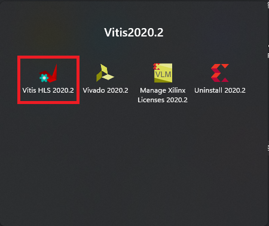
  
點擊`Create Project`。  

  
自訂`Project name`和`Location`後按 Next。  
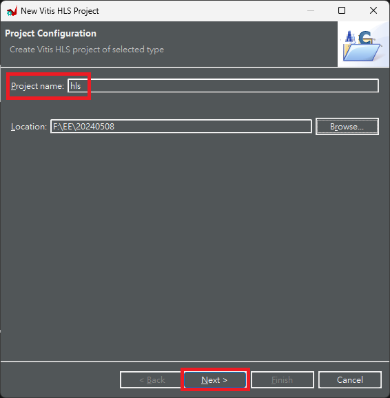
  
點擊`Add Files...`。  
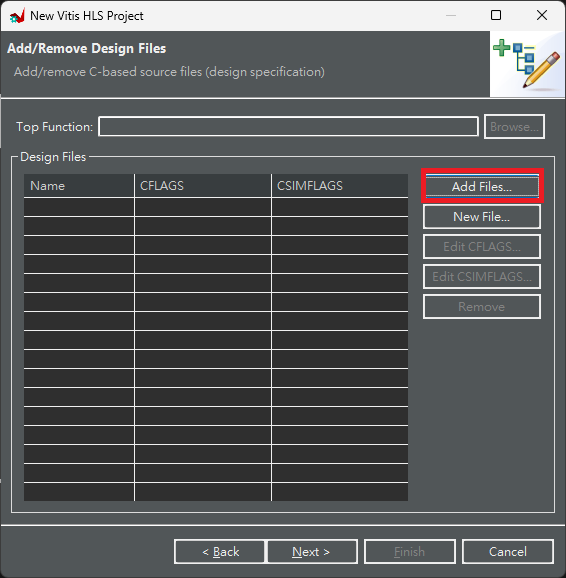
  
選擇下載的`example.cpp`後按開啟。  

  
點擊`Browse...`。  

  
選擇`example.cpp`中的`example`為`top level function`後按`OK`。  
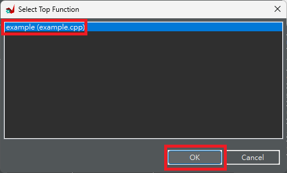
  
點擊`Next >`。  

  
點擊`Add Files...`。  
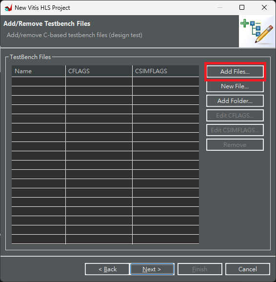
  
選擇下載的`example_test.cpp`為`testbench file`後按開啟。  

  
點擊`Next >`。  

  
在`Part Selection`部分點擊`...`框框。  

  
點擊`Boards`。  

  
選擇`Zynq UltraScale+ ZCU102 Evaluation Board`後按`OK`。  
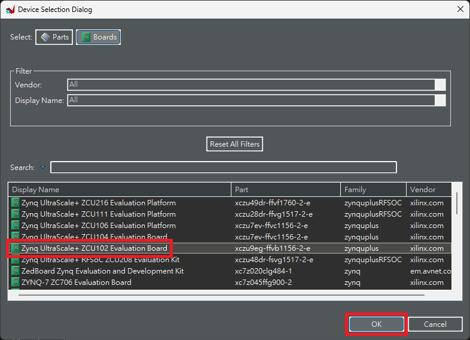
  
其餘選項保持預設，點擊`Finish`。  
**註解: 如果想要以不同的速度運行設計，可以改變週期。**  
**註解: 設計最終運行的速度將在 Vivado 中建立專案時決定。**  
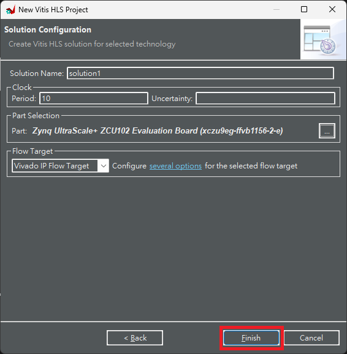
  
在`Explorer`中展開`Source`選項，點擊`example.cpp`。  
**註解: 該程式碼有一個函數，具有一個輸入 AXI stream 和一個輸出 AXI stream。**  
**註解: 函數將從輸入 AXI stream（A）讀取數據，加上 5，然後寫出該值。**  
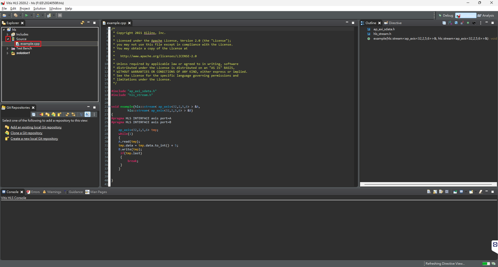
  
`#pragma`將指定 A 和 B 應作為`AXI STREAM`介面（`axis`）。  
**註解: Vitis HLS 將會根據程式碼中的使用方式自動判定 stream 是輸入還是輸出。**  
```c++
#pragma HLS INTERFACE axis port=A
#pragma HLS INTERFACE axis port=B
```
  
將下方程式碼加在兩個`#pragma`後面，保存`example.cpp`的改動。  
**註解: 此程式碼將新增一個 AXI Lite 控制介面給此 IP。**  
**註解: AXI Lite 控制介面允許我們使用控制暫存器來啟動和停止 IP（並自動啟動），並檢查 IP 是否完成。**  
**註解: 可以跳過這一步，但會使此 IP 只有一個輸入 AXI stream 和一個輸出 AXI stream，它將自動處理收到的任何數據。**  
```c++
#pragma HLS INTERFACE s_axilite port=return
```

  
通過點擊建立按鈕來建立專案。  

  
等待專案完成。  
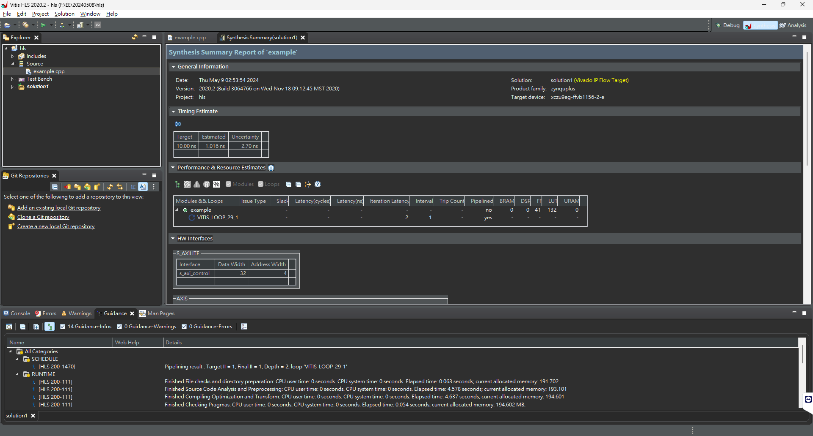
  
檢視報告的`HW interfaces`部分時，會看到通過在程式碼中添加`#pragma`而添加的`S_AXILITE介面`。這是 32 位元的控制介面。  
**註解: 在 AXI stream 協議中，`TLAST`信號是可選的，如果像在此例子中沒有明確使用，則可以被 HLS 工具省略。**  
**註解: 然而`TLAST`信號是`AXI DMA`所需要的，所以我們需要確保在此例子中包含`TLAST`信號。**  
  
  
點擊`Solution`中的`Export RTL`選項。  
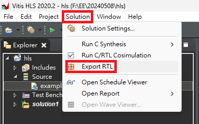
  
選項保持預設，點擊`OK`。  

  
可以在`Console`中監視匯出的進度。  

  
可以在專案目錄中的`solution1/impl/ip`裡找到匯出的 IP。這是一個包含了此 IP 所有設計的資料夾，可以在這裡找到所有相關的檔案和資訊。  
**註解: 紅框的 zip 檔案是這個目錄中所有其他檔案和資料夾的存檔（archive），這些檔案和資料夾組成了打包的 IP。這些檔案和資料夾包括硬體源碼、範例軟體驅動程式以及關於 IP 的資訊。**  
**註解: 這裡還有一些不需要的臨時和其他檔案（例如 Tcl、日誌和日誌檔案）。**  
**註解: 紅框的 zip 檔案是打包 IP 的存檔，並不包含那些額外的檔案。可以移動 zip 檔案並在其他地方解壓縮。**  
**註解: 在`./hdl/`資料夾內，有由 HLS 工具生成的 Verilog 或 VHDL 源檔案（source files）。**  
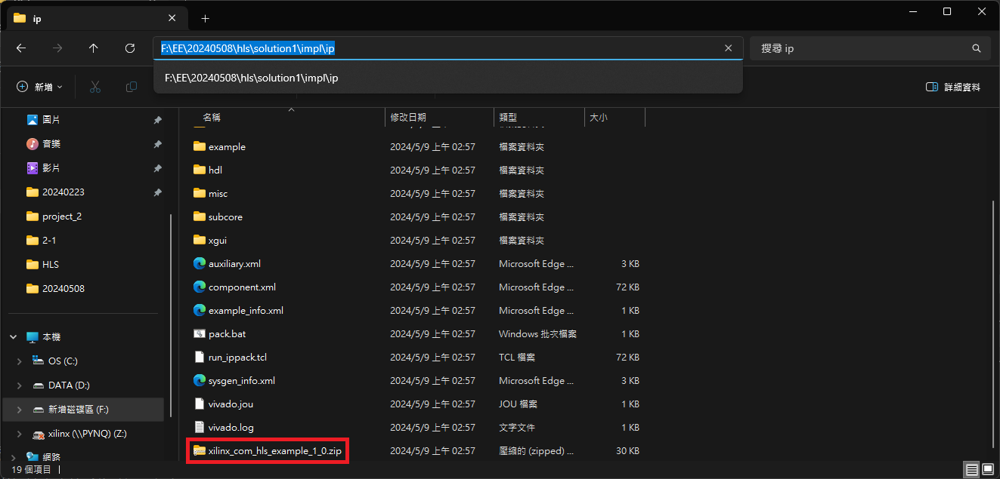
  
在`./drivers/example_v1_0/src`中打開`xexample_hw.h`檔案。這個檔案包含了 IP 的暫存器映射（register map）。稍後，這些資訊將可以從 PYNQ 的`register_map`中取得。  

  
xexample_hw.h 檔案:
1. 控制暫存器（control register）將位於偏移量（offset）0x0。寫入`1`到位元 0（bit 0）來啟動這個 IP。  
2. 可以讀回這個控制暫存器並檢查位元 1（bit 1）來看 IP 是否已經完成操作。  
```c++
// ==============================================================
// Vitis HLS - High-Level Synthesis from C, C++ and OpenCL v2020.2 (64-bit)
// Copyright 1986-2020 Xilinx, Inc. All Rights Reserved.
// ==============================================================
// control
// 0x0 : Control signals
//       bit 0  - ap_start (Read/Write/COH)
//       bit 1  - ap_done (Read/COR)
//       bit 2  - ap_idle (Read)
//       bit 3  - ap_ready (Read)
//       bit 7  - auto_restart (Read/Write)
//       others - reserved
// 0x4 : Global Interrupt Enable Register
//       bit 0  - Global Interrupt Enable (Read/Write)
//       others - reserved
// 0x8 : IP Interrupt Enable Register (Read/Write)
//       bit 0  - enable ap_done interrupt (Read/Write)
//       bit 1  - enable ap_ready interrupt (Read/Write)
//       others - reserved
// 0xc : IP Interrupt Status Register (Read/TOW)
//       bit 0  - ap_done (COR/TOW)
//       bit 1  - ap_ready (COR/TOW)
//       others - reserved
// (SC = Self Clear, COR = Clear on Read, TOW = Toggle on Write, COH = Clear on Handshake)

#define XEXAMPLE_CONTROL_ADDR_AP_CTRL 0x0
#define XEXAMPLE_CONTROL_ADDR_GIE     0x4
#define XEXAMPLE_CONTROL_ADDR_IER     0x8
#define XEXAMPLE_CONTROL_ADDR_ISR     0xc
```
  
## Vivado 設計
把剛剛產生的壓縮檔`xilinx_com_hls_example_1_0.zip`解壓縮至你要的位置。  

  
建立一個專案，其`Block Diagram`如下:  
**註解: 把第六課 PYNQ DMA 範例的 AXI4-Stream Data FIFO 刪除即可得到。**  
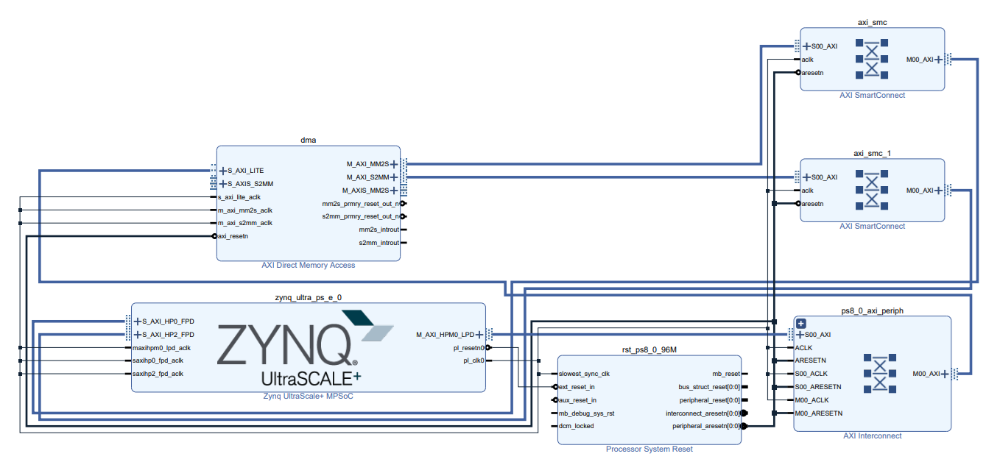
  
在 Vivado 的 Flow Manager 中，點擊`Settings`。  
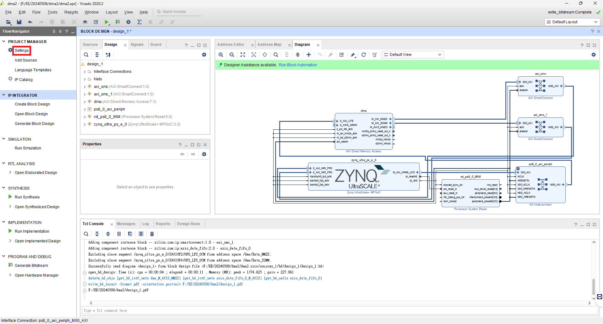
  
展開 IP，點擊 Repository 後按`+`圖示。  
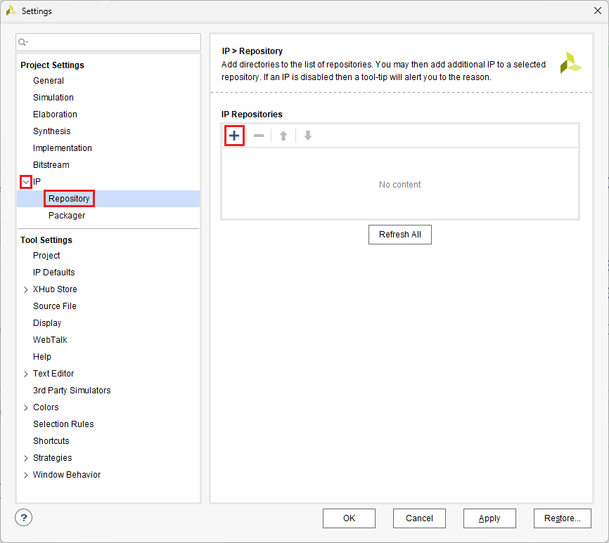

在設定中添加到 HLS IP 的路徑。  
**註解: 這將允許 Vivado 找到並使用剛剛匯出的 HLS IP。**  

  
Vivado將遞迴搜索此存儲庫中的任何IP並將其添加到目錄中，點擊`OK`。  
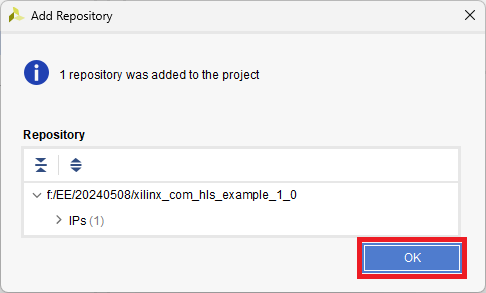
  
點擊`OK`。  
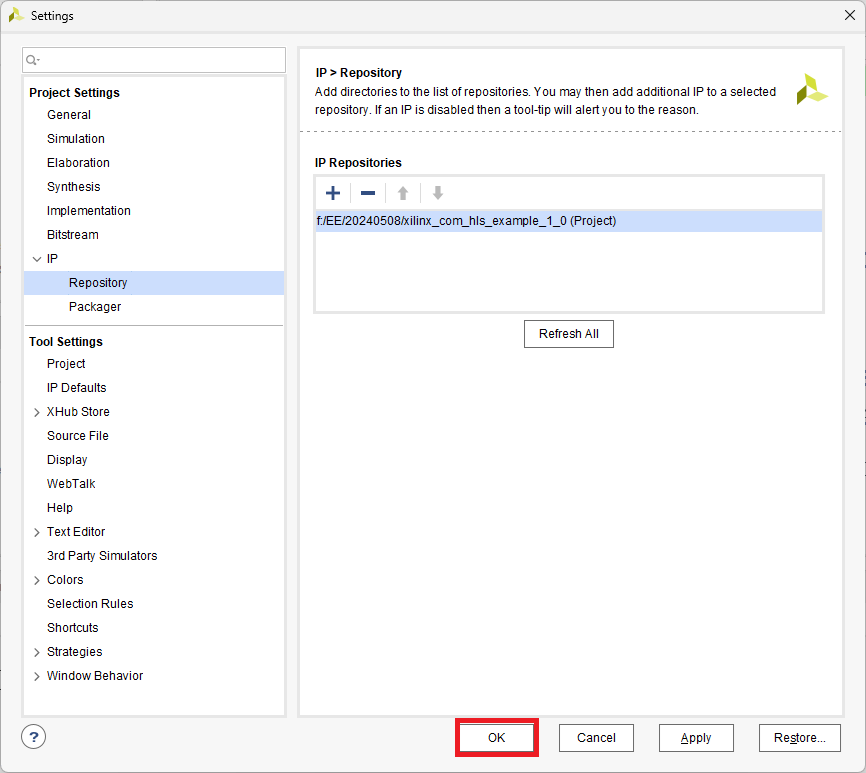
  
將 IP 添加到`Block Diagram`中，範例的 IP 叫`Example`。  
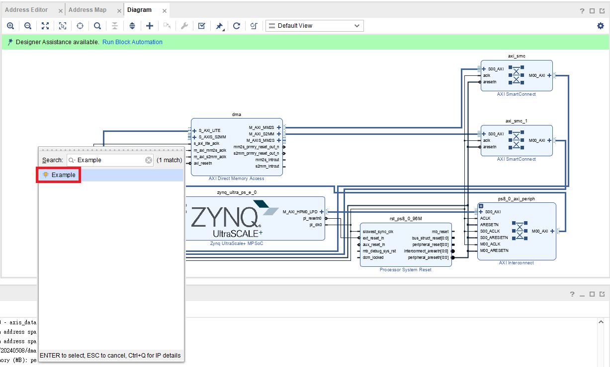
  
點擊`Run Connection Automation`。  
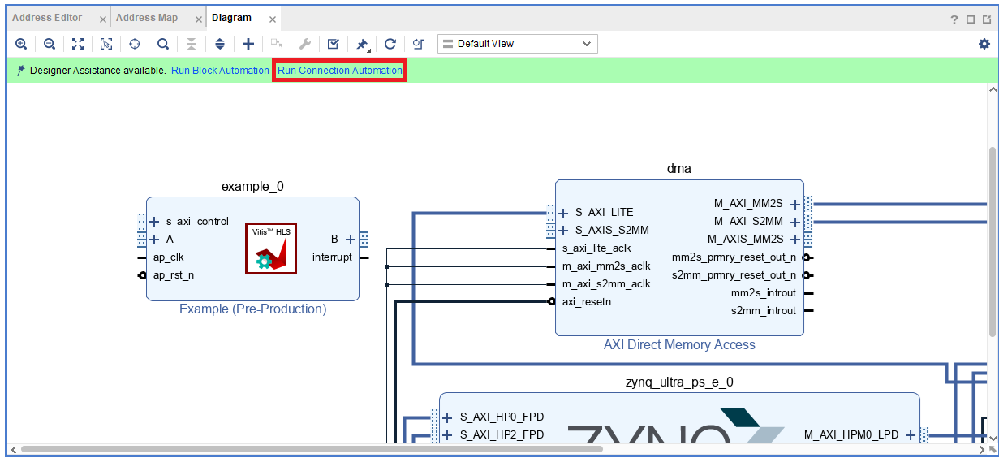
  
點擊`OK`。  
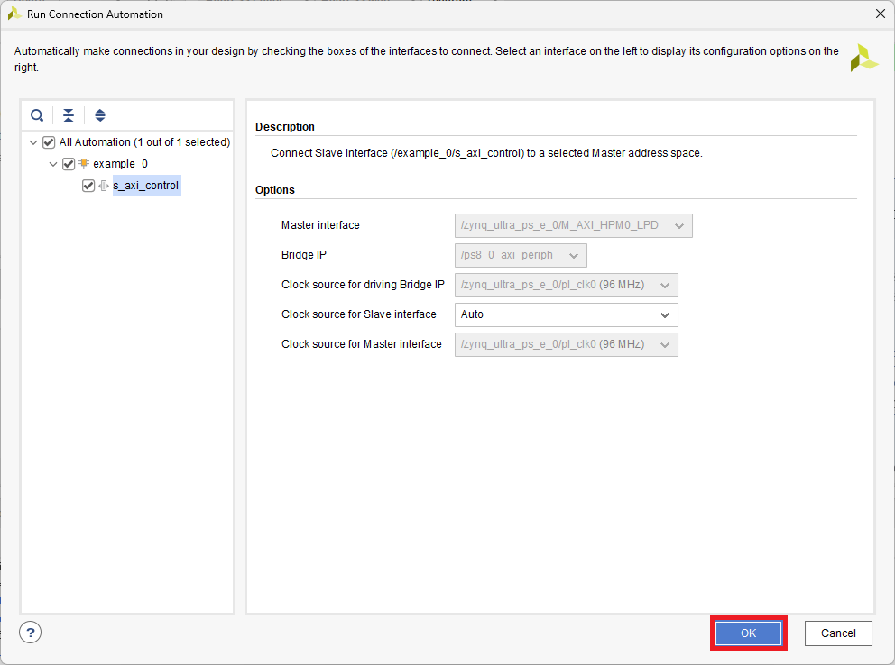
  
HLS IP 的 AXI 控制介面（s_axi_control）、時鐘（ap_clk）和 reset（ap_rst_n）會自動連接。  
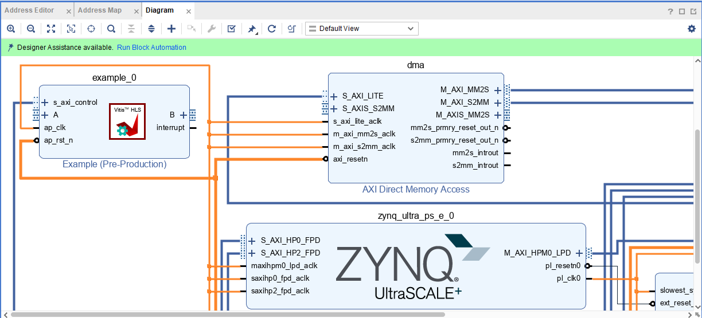
  
將 HLS IP 的 AXI stream 介面連接到 DMA:  
1. M_AXIS_MM2S → A  
2. B → S_AXIS_S2MM  
3. 中斷（interrupt）現在不會被使用，保持未連接。  
  
**註解: 一旦 HLS IP 開始運行，它將等待來自 DMA 的數據。這意味著通過 DMA 讀取和寫入數據可以有效地控制通過 HLS IP 的數據。**  

  
Create HDL Wrapper 並且 Generate Bitstream，將此設計的`.bit`檔案和`.hwh`檔案複製到 PYNQ 目錄中。  
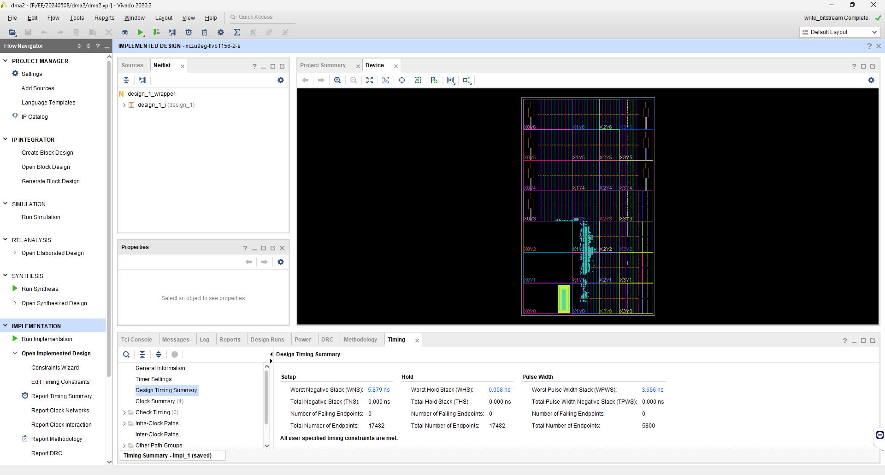
  
## 使用 PYNQ 來使用 IP  
從 PYNQ 庫中導入 Overlay，創建了一個 Overlay 物件，並加載`hls.bit`。
```python
from pynq import Overlay
ol = Overlay("./hls.bit")
```
`"./hls.bit"`代表目前的資料夾下的`hls.bit`檔案。  
  
使用 IP 字典（ip_dict）來檢查這個 Overlay 物件中的 IP。這將顯示 Overlay 物件中的所有IP，以及它們的名稱和位置。  
```python
ol.ip_dict
```
  
HLS 具有來自 Vivado 專案的預設名稱`example_0`，查看 HLS 物件的說明文件。  
```python
ol.example_0?
```
  
結果:  
```text
Type:        DefaultIP
String form: <pynq.overlay.DefaultIP object at 0xffff568de9a0>
File:        /usr/local/share/pynq-venv/lib/python3.8/site-packages/pynq/overlay.py
Docstring:  
Driver for an IP without a more specific driver

This driver wraps an MMIO device and provides a base class
for more specific drivers written later. It also provides
access to GPIO outputs and interrupts inputs via attributes. More specific
drivers should inherit from `DefaultIP` and include a
`bindto` entry containing all of the IP that the driver
should bind to. Subclasses meeting these requirements will
automatically be registered.

Attributes
----------
mmio : pynq.MMIO
    Underlying MMIO driver for the device
_interrupts : dict
    Subset of the PL.interrupt_pins related to this IP
_gpio : dict
    Subset of the PL.gpio_dict related to this IP
```
  
告訴我們這不是一個已知的 IP（類型是 DefaultIP），並將在 PYNQ 中分配一個預設驅動程式。預設驅動程式提供 MMIO 讀/寫能力。  
  
使用上面列出的 HLS IP 和 DMA 的標籤來創建別名（alias）。  
```python
dma = ol.dma
dma_send = ol.dma.sendchannel
dma_recv = ol.dma.recvchannel
hls_ip = ol.example_0 
```
  
檢查 HLS IP 的狀態，可以通過讀取 IP 的控制暫存器（control register）來完成。  
```python
hls_ip.register_map
```
  
結果:  
```text
RegisterMap {
  CTRL = Register(AP_START=0, AP_DONE=0, AP_IDLE=1, AP_READY=0, RESERVED_1=0, AUTO_RESTART=0, RESERVED_2=0),
  GIER = Register(Enable=0, RESERVED=0),
  IP_IER = Register(CHAN0_INT_EN=0, CHAN1_INT_EN=0, RESERVED=0),
  IP_ISR = Register(CHAN0_INT_ST=0, CHAN1_INT_ST=0, RESERVED=0)
}
```
  
可以看到 HLS IP 尚未啟動 (AP_START=0)，IP 處於閒置狀態 (AP_IDLE=1)。  
**註解: 我們可以先啟動 DMA 傳輸。DMA 傳輸會在 IP 啟動之前暫停（stall）。**  
  
可以通過將十六進制的`0x81`寫入控制暫存器來啟動 HLS IP。
**註解: 十六進制的 0x81 等於二進制的 1000 0001。**  
1. 將 bit 0 (AP_START) 設定為 “1”。  
2. 將 bit 7 (AUTO_RESTART) 設定為 “1”。  
  
**註解: AUTO_RESTART 表示 IP 將持續運行。如果我們不設定這個，那麼在 IP 完成一次完整的操作或迭代（iteration）後，它將停止並等待直到再次設定 AP_START。我們每次希望 IP 處理一些數據時，都必須設定這個。**  
```python
CONTROL_REGISTER = 0x0
hls_ip.write(CONTROL_REGISTER, 0x81) # 0x81 will set bit 0
```
  
再次檢查 HLS IP 的狀態。  
```python
hls_ip.register_map
```
  
結果:  
```text
RegisterMap {
  CTRL = Register(AP_START=1, AP_DONE=0, AP_IDLE=0, AP_READY=0, RESERVED_1=0, AUTO_RESTART=1, RESERVED_2=0),
  GIER = Register(Enable=0, RESERVED=0),
  IP_IER = Register(CHAN0_INT_EN=0, CHAN1_INT_EN=0, RESERVED=0),
  IP_ISR = Register(CHAN0_INT_ST=0, CHAN1_INT_ST=0, RESERVED=0)
}
```
  
從 PYNQ 庫中導入 allocate 用於分配記憶體，導入 NumPy 庫。  
```python
from pynq import allocate
import numpy as np
```
  
創建一個大小為 100 的緩衝`input_buffer`，數據類型為`np.uint32`，即 32 位無符號整數。  
**註解: 使用的陣列是 uint32。這是為了匹配 HLS IP 的數據寬度和 DMA 使用的寬度而選擇的。**  
**註解: DMA 將傳輸數據塊（blocks of data），並可能根據硬體中的內部數據寬度對其進行`重新格式化`（reformat）。**  
**註解: 在 Jupyter Notebook 中創建的陣列影響 Python 中的數據格式。**  
```python
data_size = 100
input_buffer = allocate(shape=(data_size,), dtype=np.uint32)
```
  
初始化陣列。  
```python
for i in range(data_size):
    input_buffer[i] = i
```
  
創建一個大小為 100 的緩衝`output_buffer`，數據類型為`np.uint32`。  
```python
output_buffer = allocate(shape=(data_size,), dtype=np.uint32)
```
  
執行下方四行程式碼:  
1. 執行 DMA 傳輸，將`input_buffer`中的資料從 DDR 記憶體傳輸到 HLS IP。  
2. 執行 DMA 傳輸，將資料從 HLS IP 讀取到`output_buffer`中。  
3. wait() 方法會阻塞程式的執行，直到 DMA 傳輸完成。  
```python
dma_send.transfer(input_buffer)
dma_recv.transfer(output_buffer)
dma_send.wait()
dma_recv.wait()
```
  
列印`output_buffer`的前幾個值，`output_buffer[i]`結果應該是`input_buffer[i]+5`。  
```python
for i in range(10):
    print('0x' + format(output_buffer[i], '02x'))
```
  
結果:  
```text
0x05
0x06
0x07
0x08
0x09
0x0a
0x0b
0x0c
0x0d
0x0e
```
  
驗證陣列是否相等。  
```python
print("Arrays are equal: {}".format(np.array_equal(input_buffer, output_buffer-5)))
```
  
結果:  
```text
Arrays are equal: True
```
  
刪除`input_buffer`和`output_buffer`兩個變數，釋放這兩個變數所佔用的記憶體。  
```python
del input_buffer, output_buffer
```
  
## 參考連結  
[Tutorial: using a HLS stream IP with DMA tutorial (Part 1: HLS design)](https://discuss.pynq.io/t/tutorial-using-a-hls-stream-ip-with-dma-part-1-hls-design/3344)  
[Tutorial: using a HLS stream IP with DMA (Part 2: Vivado design)](https://discuss.pynq.io/t/tutorial-using-a-hls-stream-ip-with-dma-part-2-vivado-design/3345)  
[Tutorial: using a HLS stream IP with DMA (Part 3: Using the HLS IP from PYNQ)](https://discuss.pynq.io/t/tutorial-using-a-hls-stream-ip-with-dma-part-3-using-the-hls-ip-from-pynq/3346)  
[Vitis-HLS-Introductory-Examples](https://github.com/Xilinx/Vitis-HLS-Introductory-Examples)  