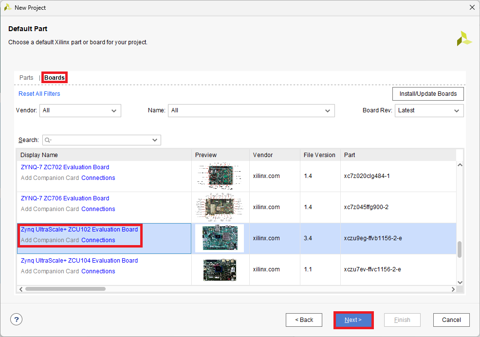
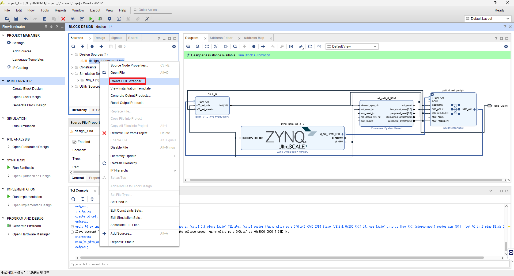

# 第八課: 新增一個AXI4-Lite的自定義IP  
參考[Zynq-7000 SoC Embedded Design Tutorial (UG1165)](https://docs.amd.com/r/en-US/ug1165-zynq-embedded-design-tutorial/Creating-Peripheral-IP?tocId=ygujVLI6H6bFdzQqvT8jKg)中的`Creating Peripheral IP`部分，利用Create and Package New IP wizard的功能製作。  
  
> [!IMPORTANT]
> 編寫此文章時文檔參考的是`2023.2 English`的版本。
  
## AXI4-Lite自定義IP功能說明  
創建的Peripheral IP是一個AXI4-Lite的slave IP。  
  
包含一個28位元的計數器，計數器的四個最高有效位(most significant bits)驅動Peripheral IP的四個輸出端口。  
  
包含以下的配置暫存器(configuration register):  
|Register Name|Control Register|
|:---|:---|
|Description|Start/Stop the Counter|
|Access Type|Read/Write|
|Width|1-bit|
|Relative Address|0x0000_0000|
  
|Field Name|Bits|Type|Reset Value|Description|
|:---|:---|:---|:---|:---|
|Control|Bit 0|R/W|0x0|1 : Start Counter 2 : Stop Counter|
  
## 製作Peripheral IP  
1. 在Vivado中點擊Create Project。  
  
  
2. 點擊Next。  
  
  
3. 自訂`Project name`和`Project location`後點擊Next。  
  
  
4. 勾選`Do not specify sources at this time`後點擊Next。  
  
  
5. 選擇`ZCU102`板子後點擊Next。  
  
  
6. 點擊Finish。  
  
  
7. 在Tools中選擇`Create and Package New IP`。  
  
  
8. 點擊Next。  
  
  
9. 選擇`Create a new AXI4 peripheral`後點擊Next。  
  
  
10. 更改`Name`為`Blink`後點擊Next。  
  
  
11. 維持預設狀態點擊Next。  
  
  
12. 在Next Steps中選擇`Edit IP`後點擊Finish。  
  
  
13. 在Hierarchy的Sources介面中，把Design Sources中的`Blink_v1_0`右鍵選擇Open File。  
  
  
14. 在`//Users to add ports here`和`//User ports ends`之中新增下方程式碼：  
  
```v
//Users to add ports here
output wire [3:0] leds,
//User ports ends
```
  
15. 找到AXI bus interface的實例化(instantiation)，添加`.leds(leds)`，如下所示：  
  
```v
.S_AXI_RREADY(s00_axi_rready),
  .leds(leds)
  );
```
  
> [!CAUTION]
> 要在`.S_AXI_RREADY(s00_axi_rready)`後面加上`,`。
  
16. 存檔並關閉`Blink_v1_0.v`。  
  
17. 在Hierarchy的Sources介面中，把Design Sources中的`Blink_v1_0_S00_AXI_inst: Blink_v1_0_S00_AXI`右鍵選擇Open File。  
  
  
18. 在`//Users to add ports here`和`//User ports ends`之中新增下方程式碼：  
  
```v
//Users to add ports here
output wire [3:0] leds,
//User ports ends
```
  
19. 找到AXI4-Lite信號部分，添加一個自定義暫存器，作為計數器。  
  
```v
// add 28-bit register to use as counter
reg [27:0] count;
```
  
20. 找到I/O連接分配部分，新增下方程式碼：  
  
```v
// assign MSB of count to LEDs
  assign leds = count[27:24];
```
  
21. 在文件的底部，找到一個標示為`// Add user logic here`的部分。新增下方程式碼：  
  
```v
// Add user logic here
  // on positive edge of input clock
  always @( posedge S_AXI_ACLK ) begin
    //if reset is set, set count = 0x0
    if ( S_AXI_ARESETN == 1'b0 ) begin
      count <= 28'b0;
    end
    else begin
      //when slv_reg_0 is set to 0x1, increment count
      if (slv_reg0 == 2'h01) begin
        count <= count+1;
      end
      else begin
        count <= count;
      end
    end
  end
// User logic ends
```
  
> [!NOTE]
> 當`slv_reg0`設定為`0x1`時，會遞增計數器的數值。如果暫存器未設定，計數器將不會遞增。  
  
22. 存檔並關閉`blink_v1_0_S00_AXI.v`。  
  
23. 打開Package IP - blink頁面。在Packaging Steps下，選擇`Ports and Interfaces`，點擊`Merge Changes from Ports and Interfaces Wizard`連結。  
  
  
24. 確保視窗已更新並包含LED輸出端口。  
  
  
28. 在Packaging Steps下，選擇`Review and Package`。在Review and Package頁面的底部，點擊`Re-Package IP`。  
  
  
29. 視窗顯示打包已完成，並詢問你是否想要關閉專案，點擊`Yes`。  
  
  
## 連接AXI4-Lite的Custom Slave IP  
1. 此時會開啟一開始的Vivado專案，並且前面製作的自定義IP路徑已經載入了。  
  
  
> [!NOTE]
> 製作的IP路徑載入可以複習[第七課: PYNQ HLS IP 範例](https://github.com/Weng20011103/ZCU102_PYNQ/tree/main/lesson7_hls_demo#vivado-%E8%A8%AD%E8%A8%88)的內容。  
  
2. 新增`Zynq UltraScale+ MPSoC`，然後將自定義IP添加到設計中。  
  
  
3. 點擊`Run Connection Automation`，確保`All Automation`是勾選的後按OK。  
  
  
4. 將LED輸出端口進行`Make External`操作。  

  
5. 進行`Create HDL Wrapper...`操作。  

  
> [!IMPORTANT]
> 實驗室電腦大約等10秒完成，然後再繼續下一步驟，不然之後某些步驟可能會報錯。  
  
6. `Create HDL Wrapper...`完成後，選擇`Open Elaborated Design`。  

  
7. 點擊OK。  

  
8. 等待Elaborated Design完成。  

  
> [!IMPORTANT]
> 實驗室電腦大約需要5分鐘完成。  
  
9. 點擊紅框的`I/O Ports`。  

  
10. 按照下方表格內容編輯leds端口設定：  

  
|Port Name|I/O Std|Package Pin|
|:---|:---|:---|
|leds_0[3]|LVCMOS33|AL12|
|leds_0[2]|LVCMOS33|AH14|
|leds_0[1]|LVCMOS33|AH13|
|leds_0[0]|LVCMOS33|AJ15|
  
> [!NOTE]
> GPIO LED的腳位可以參考[ZCU102 Evaluation Board User Guide (UG1182)](https://docs.amd.com/v/u/en-US/ug1182-zcu102-eval-bd)的第79頁(Chapter 3: Board Component Descriptions)。
  
> [!TIP]
> ZCU102的GPIO LED是`Active‐High`。

11. 選擇`Generate Bitstream`，出現Save Project視窗，點擊`Save`。  

  
12. 出現Save Constraints視窗，填好檔案名稱後點擊`OK`。  

  
13. 在Bitstream生成完成後，即可利用PYNQ載入ZCU102測試。  
