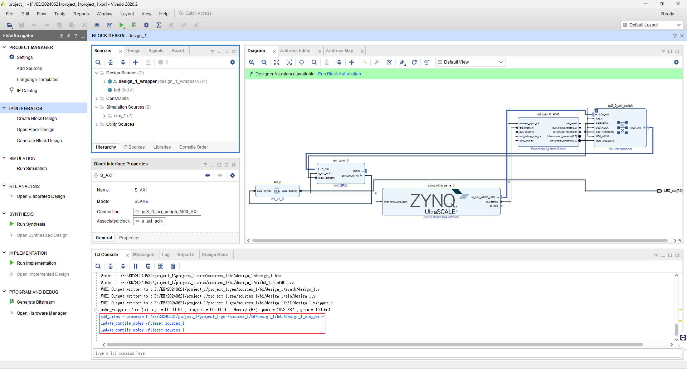

# 第九課: 在Vivado中使用TCL腳本  
本次示範如何在Vivado中使用`Tool Command Language`簡稱`Tcl`的腳本，參考[ZYNQ Training - Session 07 part III - AXI Stream in Detail (RTL Flow)](https://youtu.be/5gqU0JslJHc?si=lDOsVdeiBFnDm22m)的影片教學。  
  
本次範例的TCL腳本檔案為此資料夾的`example.tcl`檔案。  
  
> [!IMPORTANT]
> 想要了解更多可以查詢[Vivado Design Suite User Guide: Using Tcl Scripting (UG894)](https://docs.amd.com/r/en-US/ug894-vivado-tcl-scripting)等官方文檔。
  
## TCL腳本建立  
> [!WARNING]
> 本次的.tcl、.v和.xdc檔案皆儲存於`C:/Users/user/Downloads`中。
  
在要放TCL腳本的檔案總管中右鍵，點擊**在終端中開啟**。  
  
  
在PowerShell中輸入下面的命令創建一個名為`example.tcl`的新檔案：  
```console
New-Item -ItemType File -Name example.tcl
```
  
  
如果想在其他位置創建檔案，可以在`-Name`參數後面添加完整的檔案路徑。例如：  
```console
New-Item -ItemType File -Name "C:\Users\kotori\Downloads\example.tcl"
```
這條命令會在`C:\Users\kotori\Downloads\`目錄下創建`example.tcl`檔案。  
  
## TCL腳本Vivado流程  
> [!NOTE]
> 以下的Tcl指令可以從圖片中的**Tcl Console**中的藍色標示的命令找到。
  
開啟並新增一個Vivado工程，在工程頁面開啟後，點擊**Tcl Console**，將下方這兩行藍色命令複製至`example.tcl`檔案中。  
```text
create_project project_1 F:/EE/20240621/project_1 -part xczu9eg-ffvb1156-2-e
set_property board_part xilinx.com:zcu102:part0:3.4 [current_project]
```
  
  
> [!TIP]
> 在TCL檔案中使用`#`符號代表為一行註解。
  
新增一個Block Design，檔名為預設的**design_1**即可，將下方藍色命令複製至`example.tcl`檔案中。  
```text
create_bd_design "design_1"
update_compile_order -fileset sources_1
```
  
  
新增`Zynq UltraScale+ MPSoC`，將下方藍色命令複製至`example.tcl`檔案中。  
```text
startgroup
create_bd_cell -type ip -vlnv xilinx.com:ip:zynq_ultra_ps_e:3.3 zynq_ultra_ps_e_0
endgroup
```
  
  
新增一個`AXI GPIO`，將下方藍色命令複製至`example.tcl`檔案中。  
```text
startgroup
create_bd_cell -type ip -vlnv xilinx.com:ip:axi_gpio:2.0 axi_gpio_0
endgroup
```
  

把`axi_gpio_0`改成**All Outputs**並把GPIO Width改成**8**，將下方藍色命令複製至`example.tcl`檔案中。  
```text
set_property -dict [list CONFIG.C_GPIO_WIDTH {8} CONFIG.C_ALL_OUTPUTS {1}] [get_bd_cells axi_gpio_0]
```
  
  
> [!NOTE]
> 不會的回去[第二課: 由XDC綁定腳位點亮GPIO LED](https://github.com/Weng20011103/ZCU102_PYNQ/tree/main/lesson2_LED_kirakira_xdc#%E7%AC%AC%E4%BA%8C%E8%AA%B2-%E7%94%B1-xdc-%E7%B6%81%E5%AE%9A%E8%85%B3%E4%BD%8D%E9%BB%9E%E4%BA%AE-gpio-led)複習。
  
利用`Add Sources`功能將倉庫中的[led.v](https://github.com/Weng20011103/ZCU102_PYNQ/blob/main/lesson2_LED_kirakira_xdc/led.v)檔案載入，將下方藍色命令複製至`example.tcl`檔案中。  
```text
add_files -norecurse C:/Users/user/Downloads/led.v
update_compile_order -fileset sources_1
```
  
  
> [!CAUTION]
> 下載檔案的位置請自行決定。
  
> [!NOTE]
> 不會的回去[第五課: 由Clocking Wizard創造時鐘訊號及PYNQ檔案限制](https://github.com/Weng20011103/ZCU102_PYNQ/tree/main/lesson5_clocking_wizard_and_ps#%E7%AC%AC%E4%BA%94%E8%AA%B2-%E7%94%B1-clocking-wizard-%E5%89%B5%E9%80%A0%E6%99%82%E9%90%98%E8%A8%8A%E8%99%9F%E5%8F%8A-pynq-%E6%AA%94%E6%A1%88%E9%99%90%E5%88%B6)複習。
  
新增`led.v`的module到Block Design中，將下方藍色命令複製至`example.tcl`檔案中。  
```text
create_bd_cell -type module -reference led led_0
```
  
  
將`axi_gpio_0`的`gpio_io_o[7:0]`與`led_0`的`LED_in[7:0]`相連，將下方藍色命令複製至`example.tcl`檔案中。  
```text
connect_bd_net [get_bd_pins axi_gpio_0/gpio_io_o] [get_bd_pins led_0/LED_in]
```
  
  
把`led_0`的`LED_out[7:0]`Make External，然後把`LED_out_0`改成`LED_out`，將下方藍色命令複製至`example.tcl`檔案中。  
```text
startgroup
make_bd_pins_external  [get_bd_pins led_0/LED_out]
endgroup

set_property name LED_out [get_bd_ports LED_out_0]
```
  
  
進行`Run Connection Automation`操作，將下方藍色命令複製至`example.tcl`檔案中。  
```text
apply_bd_automation -rule xilinx.com:bd_rule:axi4 -config { Clk_master {Auto} Clk_slave {Auto} Clk_xbar {Auto} Master {/zynq_ultra_ps_e_0/M_AXI_HPM0_LPD} Slave {/axi_gpio_0/S_AXI} ddr_seg {Auto} intc_ip {New AXI Interconnect} master_apm {0}}  [get_bd_intf_pins axi_gpio_0/S_AXI]
```
  
  
進行`Create HDL Wrapper...`操作，將下方藍色命令複製至`example.tcl`檔案中。  
```text
make_wrapper -files [get_files F:/EE/20240621/project_1/project_1.srcs/sources_1/bd/design_1/design_1.bd] -top
add_files -norecurse f:/EE/20240621/project_1/project_1.gen/sources_1/bd/design_1/hdl/design_1_wrapper.v
update_compile_order -fileset sources_1
update_compile_order -fileset sources_1
```
  
  
新增[led.xdc](https://github.com/Weng20011103/ZCU102_PYNQ/blob/main/lesson2_LED_kirakira_xdc/led.xdc)，將下方藍色命令複製至`example.tcl`檔案中。  
```text
add_files -fileset constrs_1 -norecurse C:/Users/user/Downloads/led.xdc
```
  
  
進行`Generate Bitstream`操作，將下方藍色命令複製至`example.tcl`檔案中。  
```text
launch_runs impl_1 -to_step write_bitstream -jobs 10
```
  
  
當Bitstream完成後，可以將整個Vivado工程關閉。  
  
## 使用TCL腳本  
> [!CAUTION]
> 下方範例帶有`$`代表是要輸入的指令。
  
開啟Vivado應用程式，點擊左下角的**Tcl Console**後輸入`pwd`指令按Enter鍵。  
```console
$pwd
C:/Users/user/AppData/Roaming/Xilinx/Vivado
```
  
> [!NOTE]
> `pwd`是一個命令，用於返回當前工作路徑。
  
輸入`cd C:/path/to/your/example.tcl`指令按Enter鍵。  
```console
$cd C:/Users/user/Downloads
```
  
> [!NOTE]
> `cd`是一個命令，用於改變當前工作目錄。
  
先將先前的工程刪除(因為腳本創的工程名稱與之前一樣)。  
  
  
輸入`source example.tcl`指令按Enter鍵。  
```console
$source example.tcl
```
  
> [!NOTE]
> `source`是一個命令，用於執行指定的TCL腳本文件。
  
此時Vivado會開始執行腳本中的操作，可以根據需求自行更改TCL腳本內容。  
  